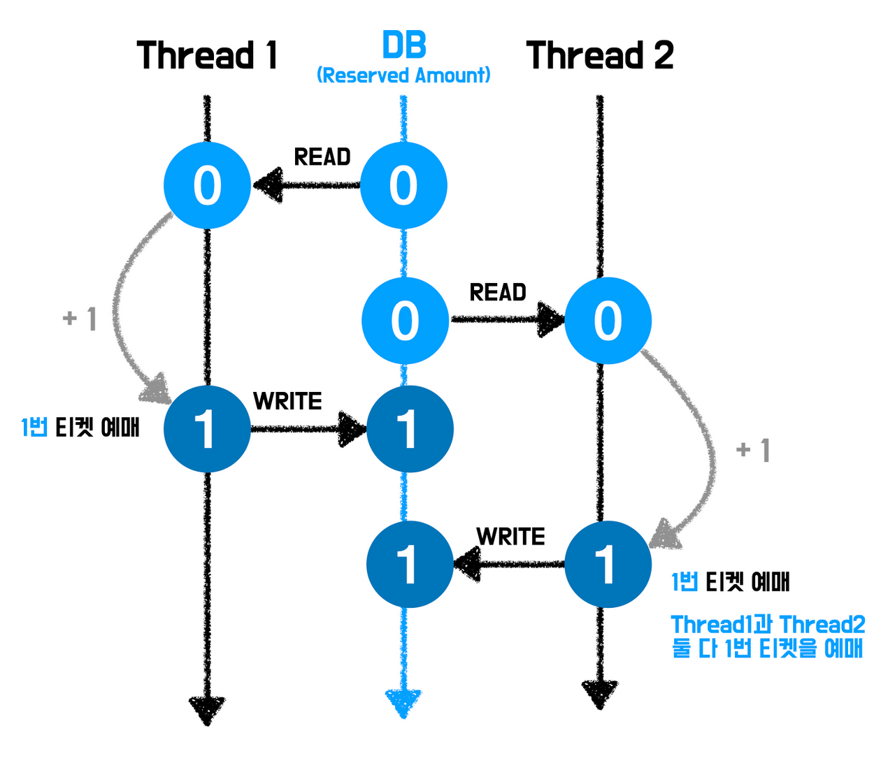
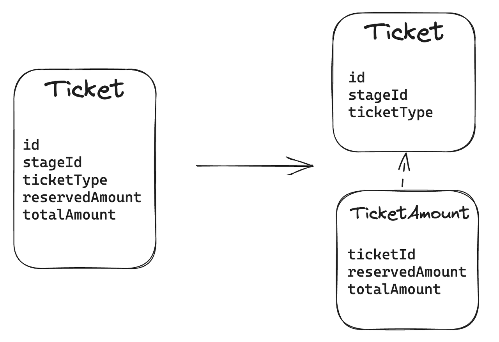
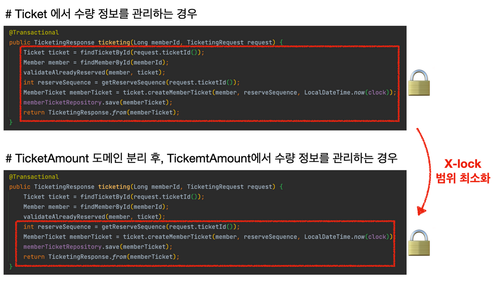
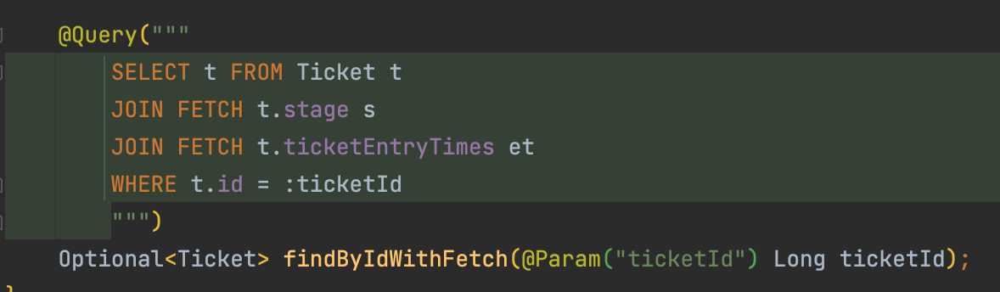
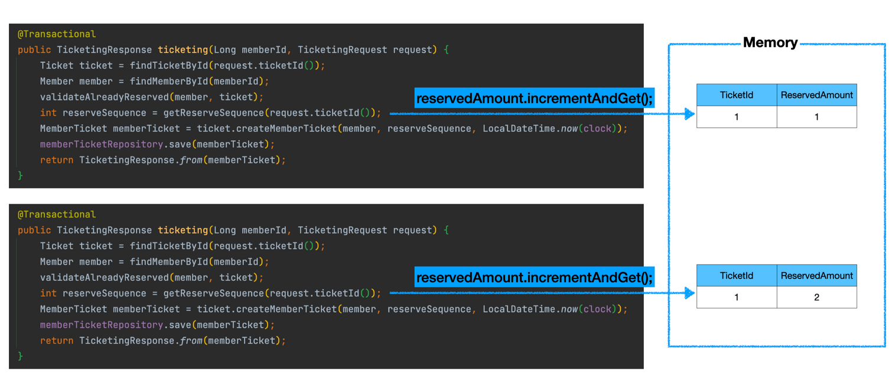
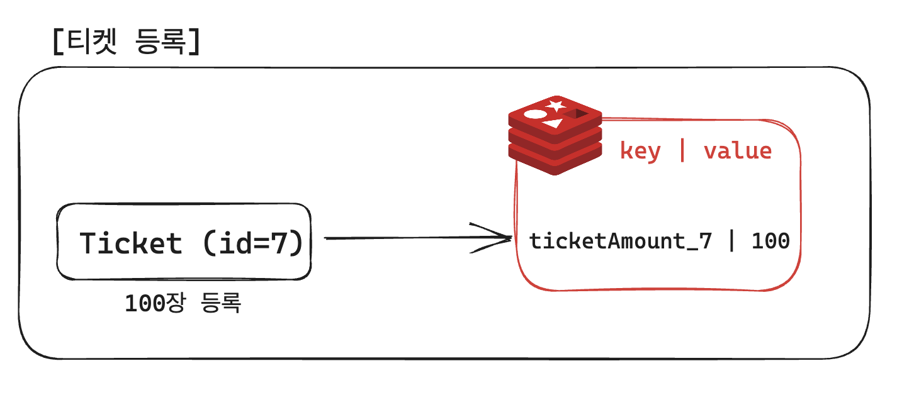
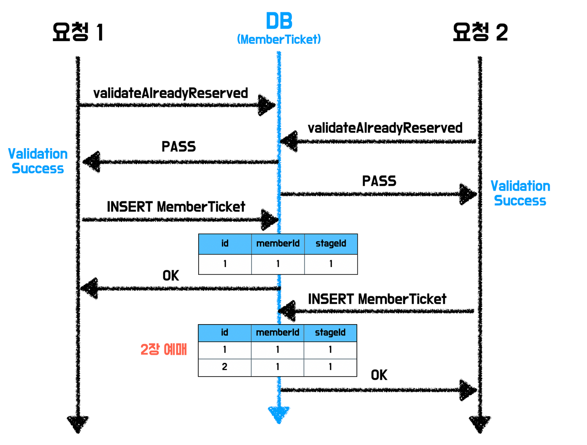

안녕하세요. 페스타고의 애쉬 입니다. 🏹

‘대학 축제 줄서기 서비스’ 페스타고를 개발하며, 티켓팅 상황에서 동시성 보장을 위해 Redis를 도입해보았습니다.


아래는 저희 팀의 요구사항과 문제 상황, 그리고 해당 문제 상황의 해결책으로 Redis를 도입한 이유입니다.


## 1. 요구사항

티켓은 지정된 수량만큼만 발급되어야합니다.

## 2. 문제 상황

동시에 여러 사용자가 예매할 때, 지정된 수량보다 더 많은 수량의 티켓이 예매됩니다.



## 3. 지금까지의 해결책

티켓 수량의 정합성을 보장하기 위하여, **비관적 락**을 적용했습니다.

하지만 비관적 락은 락을 얻기 위한 대기시간이 발생하기 때문에 성능적으로 좋지 않습니다.

### 3-1. 성능 개선책

#### ✅ TicketAmount 테이블 분리


Ticket 테이블에서 수량 정보를 TicketAmount 테이블로 분리한 후, 해당 테이블에만 비관적 락을 적용함으로써 **락 범위를 최소화**했습니다.




#### ✅ N+1 쿼리 제거

Fetch Join을 활용해 N+1 쿼리를 제거했습니다.


⇒ 결과적으로 **10% 정도의 성능 개선**을 이루어낼 수 있었습니다.


## 4. 앞으로의 성능 개선책

서버 단에서 성능 향상을 위해 일반적으로 캐싱과 DB 인덱스를 활용하곤 합니다.

하지만 티켓 예매 로직에서 가장 큰 병목은 데이터의 조회가 아닌 **Lock을 얻기 위한 대기로 인해 발생**합니다.

따라서, **가능한 Lock을 걸지 않는 것**이 성능을 향상 시키는 방법입니다.

저희는 **DB의 티켓 수량을 변경**할 때, 정합성을 보장하기 위해서 Lock을 겁니다.

따라서, **DB의 티켓 수량을 변경하지 않는 해결책**을 찾고자 했습니다.

### 4-1. AtomicInteger의 활용

첫번째 해결책으로 AtomicInteger를 활용해 **메모리에서 티켓의 수량을 변경하고 관리**하고자 했습니다.



이 방법은 DB의 데이터를 갱신하지 않기 때문에, 동시 예매 상황에서 발생하는 문제가 발생하지 않습니다.

지금의 단일 서버에서는 문제가 발생하지 않지만, 무중단 배포를 위한 다중 서버 환경에서는 메모리 공유 문제가 발생합니다.

티켓의 수량은 단순히 조회하는 값이 아닌 매 요청마다 변경되는 값이기 때문에 동기화에서 문제 발생이 우려됩니다.

### 4-2. Redis 활용

AtomicInteger의 대체제로 Redis를 활용했습니다.

Redis는 싱글 스레드이며 multiplexing 기술을 활용하여 단일 프로세스가 모든 클라이언트 요청을 처리합니다. 따라서 모든 요청이 순차적으로 처리됩니다.

네트워크 I/O가 존재하지만, 그럼에도 DB에 락을 거는 것 보다 성능이 훨씬 뛰어납니다.

3000개의 요청을 처리하는데 DB 락을 활용한 방법은 평균 12800ms가 소요되는 반면, Redis를 활용한 방법은 평균 7500ms이 소요됩니다. 이는 **40% 이상의 성능 개선**입니다.

| DB 락 | Redis |
| --- | --- |
| 12764 | 8249 |
| 14217 | 7350 |
| 12177 | 7123 |
| 11969 | 7414 |

## 5. Redis 활용법

구체적인 Redis 활용법을 알아보도록 하겠습니다.




### (1) 티켓 등록시 Redis에 값 넣어주기

티켓을 등록하면, (`ticketAmount_ticketId`, `ticketAmount`) 데이터를 Redis에 등록합니다.
(추가 수량 발급시, ticketAmount를 추가 수량만큼 더해줍니다.)


```java
public void updateTicketAmount(TicketAmountChangeEvent ticketAmountChangeEvent) {
    Long ticketId = ticketAmountChangeEvent.ticketId();
    Integer ticketAmount = ticketAmountChangeEvent.ticketAmount();
    redisTemplate.opsForValue().set("ticketAmount_" + ticketId.toString(), ticketAmount.toString());
}
```

### (2) 티켓팅시 Redis에서 수량 관리하기


Redis의 DECR 연산으로티켓팅에서 해당 티켓의 잔여 수량을 조회함과 동시에, 잔여 수량을 1 감소합니다.

이 때, 잔여 수량 "조회"와 "1 감소"는 원자적인 단위로 이루어져 동시성 문제가 발생하지 않습니다.


```java
public Optional<Integer> getSequence(Ticket ticket) {
    Integer totalAmount = ticket.getTicketAmount().getTotalAmount();
    Long quantity = getQuantity(ticket.getId());
    if (quantity == null || quantity < 0) {
        return Optional.empty();
    }
    return Optional.of(totalAmount - quantity.intValue());
}
```

잔여 수량이 0 이상이면, 티켓팅에 성공한 것으로 총 수량에서 잔여 수량을 빼 티켓 순번을 결정합니다.

잔여 수량이 0보다 적으면 이는 품절된 것으로, 티켓팅에 실패합니다.


## 6. 추가적인 활용법

저희 서비스의 요구사항으로, 한 사용자는 특정 무대에 대해 한 장의 티켓만 발급할 수 있습니다.

하지만 한 사용자가 동시에 여러 요청을 보내면, 티켓이 여러 장 발급되는 문제(일명 **“따닥” 문제**)가 발생했습니다.



이는 DB의 MemberTicket 테이블에 **(memberId, stageId) Unique 제약조건**을 걸어줌으로써 해결할 수 있습니다.

하지만 Unique 제약 조건은 Change Buffer 기능을 비활성화 시킴으로 데이터 삽입 연산의 성능이 저하되는 문제가 발생합니다.

또한, 한 사용자당 발급 가능 횟수가 1회에서 2회로 변경될 경우 해당 방법으로 해결할 수 없습니다.

이러한 따닥 문제를 해결하기 위한 해결책으로도 Redis를 활용하였습니다.


### 6-1. 따닥 문제 해결하기

티켓 예매 시도시, 해당 memberId와 stageId의 복합키 `trialCount_stageId_memberId` 의 값을 incrementAndGet 합니다.

해당 연산의 반환값이, 발급 가능 매수보다 크면 예외처리합니다.

해당 연산은 티켓 발급 가능 여부를 확인하는 연산과 **원자적인 단위**로 묶여있기 때문에, 동시 예매의 문제가 발생하지 않습니다.

아래는 해당 연산의 스크립트입니다.

```lua
local memberTryCount = redis.call("INCR", KEYS[1])
redis.call("EXPIRE", KEYS[1], 1)

-- 따닥인 경우
if memberTryCount > tonumber(ARGV[1])
then
  return -2
end

local remainAmount = redis.call("DECR", KEYS[2])

-- 품절인 경우
if remainAmount < 0
then
  return -1
end

return remainAmount
```

아래는 lua 스크립트를 활용한 서비스 코드입니다.

```java
public Optional<Integer> getSequence(Ticket ticket, Member member) {
    Long remainAmount = redisTemplate.execute(
        redisScript,
        List.of(makeMemberKey(ticket, member), makeTicketAmountKey(ticket)),
        MAX_MEMBER_TRIAL_COUNT);
    if (remainAmount == null || remainAmount < 0) {
        return Optional.empty();
    }
    Integer totalAmount = ticket.getTicketAmount().getTotalAmount();
    return Optional.of(totalAmount - remainAmount.intValue());
}

private String makeMemberKey(Ticket ticket, Member member) {
    Long stageId = ticket.getStage().getId();
    Long memberId = member.getId();
    return String.format("trialCount_%d_%d", stageId, memberId);
}

private String makeTicketAmountKey(Ticket ticket) {
    return String.format("ticketAmount_%d", ticket.getId());
}
```


---

## **적용 코드 링크**

[https://github.com/woowacourse-teams/2023-festa-go/pull/428](https://github.com/woowacourse-teams/2023-festa-go/pull/428)