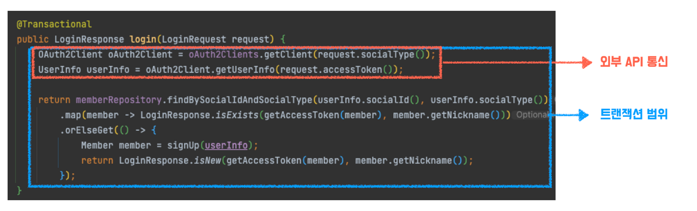
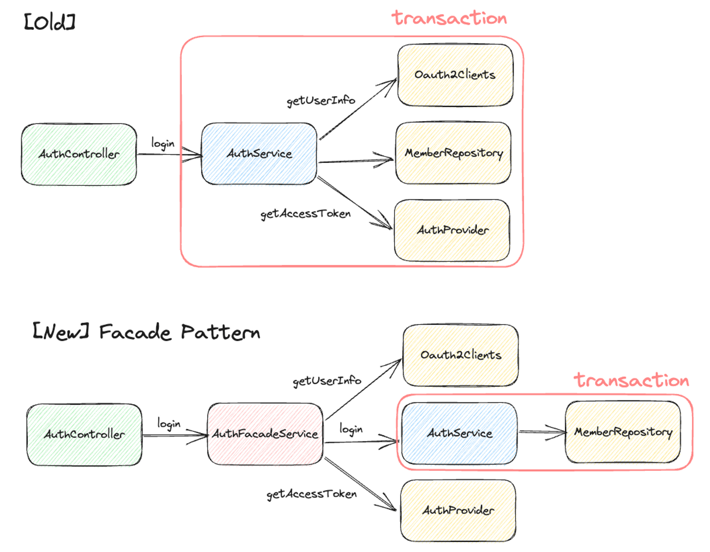

안녕하세요. 페스타고팀의 애쉬입니다. 🏹

페스타고 팀에서 Facade 객체를 활용해 외부 API 통신을 분리한 과정을 설명하고자 합니다.

## 문제 상황


Oauth2 기반 로그인 메서드에서, Oauth2 API 통신이 트랜잭션 범위 안에 속해있었습니다.



외부 API 통신은 비교적 시간이 오래 걸리는 메서드로, 이가 트랜잭션 범위 안에 포함되면 DB 커넥션을 가지고 있는 시간과 트랜잭션이 활성화된 시간이 불필요하게 길어집니다. 이는 성능 저하와 직결되는 문제입니다.

따라서 외부 API 통신 코드를 트랜잭션 범위에서 분리하는 것이 바람직합니다.

## Facade 패턴 적용

파사드 패턴(Facade Pattern)을 적용하여 해당 문제를 해결하였습니다.

파사드 패턴이란, 서브 시스템을 감추는 상위 수준의 인터페이스를 제공함으로써 시스템의 복잡도를 낮추는 디자인 패턴입니.

우리 팀은 아래와 같이 AuthService 상위에 AuthFacadeService 객체를 도입함으로써, 트랜잭션의 범위를 최소한으로 줄였습니다.

(외부 API 통신과 함께, accessToken 생성 로직도 트랜잭션 범위에서 제외하였습니다.)



아래는 파사드 객체를 도입한 코드입니다.

```java
@Service
public class AuthFacadeService {

    private final AuthService authService;
    private final OAuth2Clients oAuth2Clients;
    private final AuthProvider authProvider;

    /***/

    public LoginResponse login(LoginRequest request) {
        LoginMemberDto loginMember = authService.login(getUserInfo(request));
        String accessToken = getAccessToken(loginMember.memberId());
        return LoginResponse.of(accessToken, loginMember);
    }

    private String getAccessToken(Long memberId) {
        return authProvider.provide(new AuthPayload(memberId, Role.MEMBER));
    }

    private UserInfo getUserInfo(LoginRequest request) {
        OAuth2Client oAuth2Client = oAuth2Clients.getClient(request.socialType());
        return oAuth2Client.getUserInfo(request.accessToken());
    }

    public void deleteMember(Long memberId) {
        authService.deleteMember(memberId);
    }
}
```

```java
@Service
@Transactional
public class AuthService {

    private final MemberRepository memberRepository;

    /***/

    public LoginMemberDto login(UserInfo userInfo) {
        return memberRepository.findBySocialIdAndSocialType(userInfo.socialId(), userInfo.socialType())
            .map(LoginMemberDto::isExists)
            .orElseGet(() -> {
                Member member = signUp(userInfo);
                return LoginMemberDto.isNew(member);
            });
    }

    private Member signUp(UserInfo userInfo) {
        return memberRepository.save(userInfo.toMember());
    }

    public void deleteMember(Long memberId) {
        Member member = memberRepository.findById(memberId)
            .orElseThrow(() -> new NotFoundException(ErrorCode.MEMBER_NOT_FOUND));
        memberRepository.delete(member);
    }
}
```


## 해당 PR 링크

https://github.com/woowacourse-teams/2023-festa-go/pulls?q=is%3Apr+is%3Aclosed