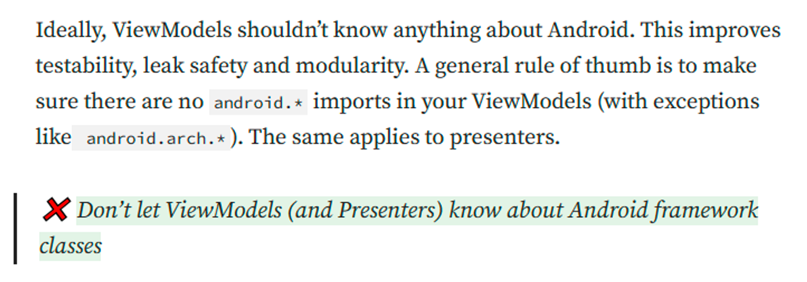
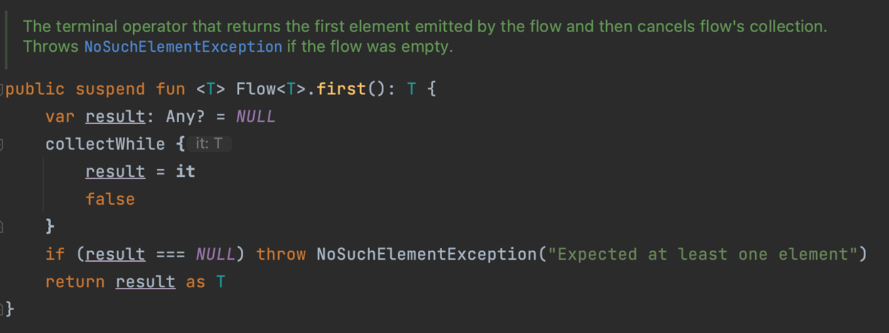
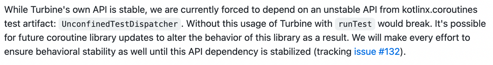

---

안녕하세요. 페스타고의 베르입니다.

페스타고 앱을 개발하면서 LiveData 를 StateFlow 와 SharedFlow 로 리팩터링 했습니다. 리팩터링한 이유, 과정 그리고 어려웠던 점까지 공유하려고 합니다.

---

Festago 를 개발하면서 ViewModel 의 UiState 및 Event 를 감지하기 위해 LiveData 를 사용했다.



이상적으로 ViewModel 은 Android 를 알아선 안된다. 테스트 가능성, 메모리 누수 안전성, 모듈성을 향상시킨다.

참고: AndroidDevelopers 블로그

https://medium.com/androiddevelopers/viewmodels-and-livedata-patterns-antipatterns-21efaef74a54

이를 이유로 안드로이드 의존성을 갖는 LiveData 를 사용하던 기존 코드들을 Kotlin 의존성을 갖는 Flow 로 Migration 해보기로 했다.

StateFlow 와 SharedFlow 에 대한 이론적인 글은 개인 블로그 글을 참고해주세요.

https://seonghoonc.tistory.com/30

## 화면 소개

Migration 할 학교 인증(StudentVerification)을 하는 화면이다.


1. Activity 를 시작하면 학교 ID 로 학교 이메일을 받아온다
2. 인증 번호 확인에 성공, 실패, 타임아웃 등 이벤트를 발생시킨다.

## UiState LiveData to StateFlow

```kotlin
sealed interface StudentVerificationUiState {
		// 로딩 상태
    object Loading : StudentVerificationUiState

		// 성공 상태
    data class Success(
        val schoolEmail: String,
        val remainTime: Int,
        val isValidateCode: Boolean = false,
    ) : StudentVerificationUiState

		// 에러 상태
    object Error : StudentVerificationUiState

	...
}
```

uiState 는 위와 같이 sealed interface 로 정의된다. 로딩, 성공, 실패 상태가 있으며 그에 따라 각각 다른 화면을 보여준다.

```kotlin
class StudentsVerificationViewModel(
    private val schoolRepository: SchoolRepository,
	  // ...
) : ViewModel() {

		// 로딩 상태로 초기화
    private val _uiState = MutableLiveData<StudentVerificationUiState>(StudentVerificationUiState.Loading)
    val uiState: LiveData<StudentVerificationUiState> = _uiState

    fun loadSchoolEmail(schoolId: Int) {
				...
        viewModelScope.launch {
            schoolRepository.loadSchoolEmail(schoolId)
								// 성공하면 성공 상태로 set
                .onSuccess { email ->
                    _uiState.value = StudentVerificationUiState.Success(
                        schoolEmail = email,
                        remainTime = MIN_REMAIN_TIME,
                    )
                }
								// 실패하면 에러 상태로 set
                .onFailure {
                    _uiState.value = StudentVerificationUiState.Error
                    // ...
                } 
        }
    }
```

이때 ViewModel 의 loadSchoolEmail() 을 호출하면 repository 로 학교 이메일을 요청하고 결과에 따라UiState 를 업데이트한다.

이를 StateFlow 로 바꾸면?

```kotlin
class StudentsVerificationViewModel(
    private val schoolRepository: SchoolRepository,
    //...
) : ViewModel() {
    // 로딩 상태로 초기화 LiveData 와 달리 초기값이 필수다.
    private val _uiState = MutableStateFlow<StudentVerificationUiState>(StudentVerificationUiState.Loading)
    val uiState: StateFlow<StudentVerificationUiState> = _uiState.asStateFlow()
	

```

ViewModel 에서 코드는 거의 비슷하다! StateFlow 는 초기 값을 필수로 지정해줘야 한다. 그것 말고는 별 다른게 없다.

Activity 에서는 다음과 같이 변경해야한다.

1. observe 를 collect 로 변경한다.
2. Lifecycle 변경을 감지할 수 있도록 처리한다.

```kotlin

lifecycleScope.launch {
        repeatOnLifecycle(Lifecycle.State.STARTED) {
						viewModel.uiState.collect { uiState ->
                handleUiState(uiState)
            }
        }
    }
```

stateFlow 는 LiveData 와 달리 알아서 LifeCycle 을 감지하지 못한다.

홈 화면을 누르거나 다른 액티비티에 가리는 등 생명주기가 Stopped 상태일 때 계속해서 collect 하고 있지 않도록 repeatOnLifecycle 을 사용해 처리했다.

이 과정에서 ViewModel 테스트는 어떻게 되었을까?

### ViewModel Test with LiveData

기존 LiveData 사용 시 테스트다. 테스트에 관한 자세한 얘기는 생략하겠다.

```kotlin
@get:Rule
val instantExecutorRule = InstantTaskExecutorRule()

@Test
fun `이메일 불러오기에 실패하면 실패 상태가 된다`() {
    // given
    `이메일 요청 결과가 다음과 같을 때`(Result.failure(Exception()))

    // when
    viewModel.loadSchoolEmail(schoolId)

    // then : 
    assertThat(viewModel.uiState.value).isExactlyInstanceOf(StudentVerificationUiState.Error::class.java)
}
```

ViewModel 의 uiState 의 value 가져와 검증한다.

안드로이드 의존성을 갖는 LiveData 를 ViewModel 에서 사용하면 ViewModel 을 단위 테스트하기 위해 Rule을 추가해줘야 한다.

### ViewModel Test with StateFlow

테스트를 짜다보면 리팩터링 할 때 기존 테스트코드에 빨간줄이 생기는 경험을 하게된다. 하지만 이 경우엔 없다!

value 로 뽑아서 가져오는 방식이 LiveData 와 똑같기 때문이다.

**더 이상 사용하지 않는 Rule 만 제거해주면 된다.**

## Event 처리 LiveData to SharedFlow

Event Wrapping class 를 사용한 커스텀 SingleLiveData 를 사용하고 있었다.

그 이유는 다음 글로 확인하길 바란다.

https://festago.github.io/event-singlelivedata/

```kotlin
private val _event = MutableSingleLiveData<StudentVerificationEvent>()
val event: SingleLiveData<StudentVerificationEvent> = _event

fun confirmVerificationCode() {
    viewModelScope.launch {
        // ...
        studentVerificationRepository.requestVerificationCodeConfirm(...)
            .onSuccess {
                _event.setValue(StudentVerificationEvent.VerificationSuccess)
            }.onFailure {
            _event.setValue(StudentVerificationEvent.VerificationFailure)
         }
     }

```

발생시키고 싶은 Event 가 있다면 MutableSingleLiveData 의 value 를 set 하면 된다.

```kotlin
private val _event = MutableSharedFlow<StudentVerificationEvent>()
val event: SharedFlow<StudentVerificationEvent> = _event.asSharedFlow()

fun confirmVerificationCode() {
		viewModelScope.launch {
			...
	      studentVerificationRepository.requestVerificationCodeConfirm(...)
				.onSuccess {
            _event.emit(StudentVerificationEvent.VerificationSuccess)
         }.onFailure {
            _event.emit(StudentVerificationEvent.VerificationFailure)
         }
     }
```

하지만 sharedFlow 는 value 를 사용하지 않는다. 발생시키고 싶은 Event 가 있다면 emit 을 해주면 된다.

```kotlin
lifecycleScope.launch {
        repeatOnLifecycle(Lifecycle.State.STARTED) {
            viewModel.event.collect { event ->
                handleEvent(event)
            }
        }
    }
```

event 도 마찬가지로 Lifecycle 에 맞춰 동작하기 위해 위와 같은 이유로 repeatOnLifecycle 을 적용했다.

여기까진 아무 문제가 없었다. 하지만 테스트에서 몇가지 문제가 발생했다.

### ViewModelTest with SharedFlow

**문제점 1.  sharedFlow 는 getValue() 로 값을 얻어올 수 없다.**

sharedFlow 는 LiveData 혹은 StateFlow 와 다르게 value 를 가져올 수 없다.  그렇기 때문에 방출되는 값을 반환받을 방법이 필요했다.

해결 방법 : Flow 의 first() 확장함수 사용



first 의 내부 구조를 보면 알 수 있듯  이 함수는 방출되는 가장 첫번째 값을 반환하며 일정 시간동안 방출되지 않으면 NoSuchElementException() 을 발생시킨다.

```kotlin
@Test
fun `... 인증 번호 확인이 성공하면 인증 성공 이벤트가 발생한다`() = runTest {
        // given
        // ...

        // when
        viewModel.confirmVerificationCode()

        // then
        assertThat(vm.event.first()).isEqualTo(StudentVerificationEvent.VerificationSuccess)
    }
```

flow 는 코루틴 위에서 동작한다. 따라서 suspend function 인 first() 를 사용하려면 runTest 를 사용해 TestScope 를 열어줘야 한다.

하지만 이것은 곧바로 다음 문제를 직면한다.

**문제점 2. sharedFlow 가 값을 방출할 때 까지 기다리지 않는다.**

이전의 코드는 처음으로 방출된 event 를 받아오지만 viewModel.confirmVerificationCode() 와 vm.event.first() 가 동기적으로 실행된다. 실제로 방출된 이후 값을 기다리게 되어 기다리기만 하다가 결국 예외가 발생한다.

값이 들어올 때 까지 기다리게 하기 위해서 async scope 를 열고 값이 반환된 후에 assertThat 검증이 실행되도록 변경하였다.

```kotlin
@Test
fun `given ... 인증 번호 확인이 성공하면 인증 성공 이벤트가 발생한다`() = runTest(UnConfinedTestDispather()) {
        // given
        // ...

        // sharedFlow Event 기다리기
        val deferredEvent = async {
            vm.event.first()
        }

        // when
        viewModel.confirmVerificationCode()

        // then
        assertThat(deferredEvent.await()).isEqualTo(...)
    }
```

이렇게 하면 처음으로 방출되는 이벤트가 반환될 때까지 기다렸다가 검증하여 테스트가 정상적으로 작동한다.

이때 주의할 점은 테스트의 즉각적인 실행을 위해 UnConfinedTestDispatcher 를 사용해야 한다.

- UnConfinedTesDispatcher : 코루틴 빌더가 반환될 때까지 기다리지 않고 즉시 실행해 예상 가능한 결과를 테스트할 수 있다.

테스트의 정상 작동은 확인했지만 그래도 아직 마음에 들지 않는다.

**문제점3. 테스트는 편리해야 한다.**

매번 deferred  type 으로 기다리게 하고 await 으로 값을 체크하는 것은 용납할 수 없는 불편함이다. 그러다 찾은 것이 바로 turbine 이다.

turbine 은 Flow Test third-party 라이브러리로 공식문서에서 편리한 Flow 테스트를 위해 사용해라고 소개되어있다.

https://developer.android.com/kotlin/flow/test

https://github.com/cashapp/turbine

이 turbine 라이브러리를 사용하면 turbine 스코프를 열 수 있는데 이를 사용하면 훨씬 간단하게 위의 테스트를 진행할 수 있다.

```kotlin
@Test
fun `... 인증 번호 확인이 성공하면 인증 성공 이벤트가 발생한다`() = runTest {
        // given
        ...

				**vm.event.test { // turbineScope**
        
        // when
				viewModel.confirmVerificationCode()

**            // then
            assertThat(awaitItem()).isEqualTo(...)
            cancelAndIgnoreRemainingEvents()
        }
    }
```

test turbine 스코프 내에서 awaitItem() 을 사용할 때마다 방출되는 값을 받을 수 있고 cancelAndIgnoreRemainingEvents() 를 사용해  남은 이벤트를 받지 않고 코루틴 스코프를 cancel 할 수 있다.

아무 이벤트도 일어나지 않음을 테스트하려면 `expectNoEvents() 를 사용하면 된다.`



추가적으로 Turbine 은 UnconfinedTestDispatcher 에 의존하고 있다. 이는 테스트를 더 쉽게 만들지만 이를 인지하고 사용해야 한다.

다음은 학습을 위해 작성한 테스트 코드이다.

```kotlin
class SharedFlowTest {

    private val _sharedFlow = MutableSharedFlow<Int>(replay = 0)
    val sharedFlow = _sharedFlow.asSharedFlow()

    // 실패
    @Test
    fun `test sharedFlow in StandardTestDispatcher`() = runTest {
        // when
        _sharedFlow.emit(1)

        // then
        assertThat(sharedFlow.first()).isEqualTo(1)
    }

    // 실패
    @OptIn(ExperimentalCoroutinesApi::class)
    @Test
    fun `test sharedFlow in UnconfinedTestDispatcher`() = runTest(UnconfinedTestDispatcher()) {
        // when
        _sharedFlow.emit(1)

        // then
        assertThat(sharedFlow.first()).isEqualTo(1)
    }

    // 실패
    @Test
    fun `test sharedFlow with async in StandardTestDispatcher`() = runTest {
        val deferred = async {
            sharedFlow.first()
        }
        // when
        _sharedFlow.emit(1)

        // then
        assertThat(deferred.await()).isEqualTo(1)
    }

    // 성공
    @OptIn(ExperimentalCoroutinesApi::class)
    @Test
    fun `test sharedFlow with async in UnconfinedTestDispatcher`() = runTest(UnconfinedTestDispatcher()) {
        val deferred = async {
            sharedFlow.first()
        }
        // when
        _sharedFlow.emit(1)

        // then
        assertThat(deferred.await()).isEqualTo(1)
    }

    // 성공
    @Test
    fun `test sharedFlow with turbine in StandardTestDispatcher`() = runTest {
        sharedFlow.test {
            // when
            _sharedFlow.emit(1)

            // then
            assertThat(awaitItem()).isEqualTo(1)
        }
    }

		// 성공
    @OptIn(ExperimentalCoroutinesApi::class)
    @Test
    fun `test sharedFlow with turbine in UnconfinedTestDispatcher`() = runTest(UnconfinedTestDispatcher()) {
        sharedFlow.test {
            // when
            _sharedFlow.emit(1)

            // then
            assertThat(awaitItem()).isEqualTo(1)
        }
    }
```

이 결과를 확인하면 더 쉽게 이해할 수 있을 것이다.

## 해당 PR 링크

https://github.com/woowacourse-teams/2023-festa-go/pull/429

### 다른 화면 리팩터링

https://github.com/woowacourse-teams/2023-festa-go/pull/493
https://github.com/woowacourse-teams/2023-festa-go/pull/494
https://github.com/woowacourse-teams/2023-festa-go/pull/495