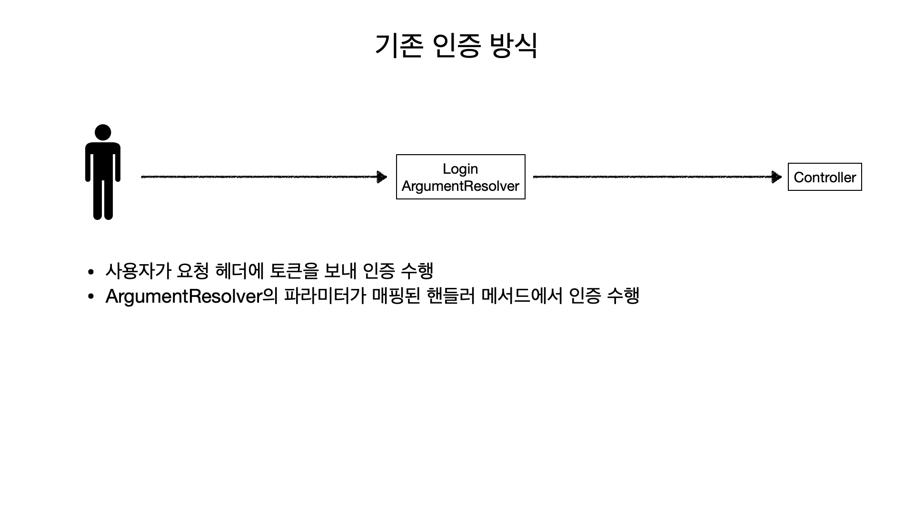
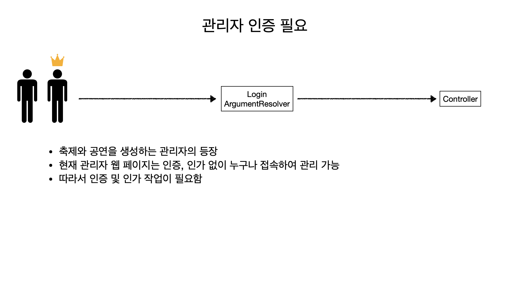
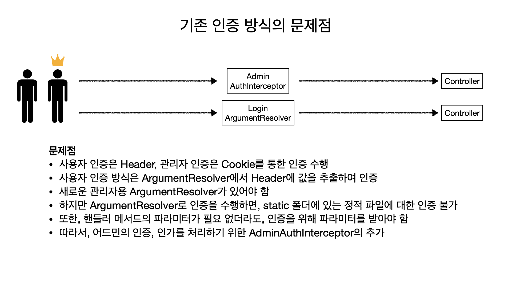
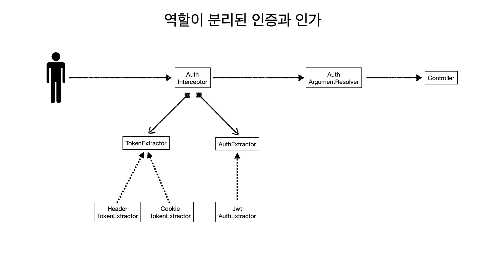

## 서론

안녕하세요.

페스타고의 글렌입니다. 🥃

페스타고에는 다양한 역할의 사용자가 존재합니다.

이렇게 다양한 역할의 사용자가 있다면 사용자의 역할에 맞는 인증과 인가 작업이 필요합니다.

단순히 역할에 따른 구분이라면 큰 문제가 없겠지만, 다양한 사용자들이 접속하는 환경에서 인증을 하는 방법에서 차이로 인해 문제가 발생했습니다.

어떠한 문제점에 직면했고, 이것을 어떻게 해결했는지 설명하겠습니다.
## 본론

페스타고는 축제의 공연에 대한 티켓팅을 오프라인으로 기다리지 않고 온라인으로 편하게 예매하고 빠르게 출입을 가능하게 해주는 서비스입니다.

잠깐 저희 서비스의 흐름에 관해 이야기를 해보겠습니다.

사용자가 공연에 대해 티켓을 예매하려고 합니다.

이때, 사용자가 티켓을 예매하려면 우선 공연과 축제가 생성되어 있어야 합니다.

그렇다면 공연과 축제는 티켓을 예매하는 사용자가 생성을 하는 것일까요?

공연과 축제를 생성하는 것은 티켓을 예매하는 사용자가 아닌, 축제와 공연을 개최하고 싶은 관리자입니다.

그리고 예매한 티켓을 검사할 때도 마찬가지로, 티켓을 검사하는 사용자가 있습니다.

티켓을 검사하는 사용자는 공연과 축제를 생성하는 관리자가 아닌, 관리자에 의해 고용된 스태프일 것입니다.

이처럼 페스타고에는 역할별로 책임이 다른 사용자가 존재합니다.

> 티켓을 예매하고 싶은 사용자 -> Member
> 
> 축제와 공연을 계획하고 개최하고 싶은 사용자 -> Admin
> 
> 티켓을 검사하고 싶은 사용자 -> Staff

이렇듯 사용자들은 각자의 역할과 책임을 가지고 있습니다.

그런데 어떻게 다양한 역할의 사용자를 구분할 수 있을까요?

저희 서비스는 JWT 토큰을 기반으로 인증을 수행하니 JWT 토큰에 다음과 같은 값을 넣을 수 있을 것 같습니다.

```json
{
    "id": 1,
    "role": "MEMBER"
}

{
    "id": 2,
    "role": "STAFF"
}

{
    "id": 3,
    "role": "ADMIN"
}
```

이렇게 토큰에 `role` 필드를 추가하면 사용자의 역할을 쉽게 구분할 수 있습니다.

하지만 여기서 문제가 발생합니다.

각 역할의 사용자들은 접속하는 환경이 다르다는 것입니다.

일반 사용자와 스태프는 모바일 앱 환경에서 저희 서비스를 이용합니다.

하지만 관리자는 모바일 앱을 사용하지 않고, 웹 페이지를 통해 저희 서비스를 이용합니다.

관리자가 접속하는 환경에서는 전용 앱을 제작할 필요가 없고 간단한 웹 페이지만 있으면 되기 때문입니다.

그런데 이것이 왜 문제가 되는 걸까요?

모바일 앱 환경에서 요청을 보낼 때는 JWT 토큰을 HTTP 헤더에 담아 요청합니다.

하지만 웹 페이지 환경에서는 JWT 토큰을 쿠키에 담아 요청합니다.

이렇게 사용자의 환경마다 토큰을 보내는 방법이 다르니 문제가 발생합니다.

여기서 이런 생각이 들 수 있습니다.

> "웹 페이지에서도 헤더에 토큰을 담아서 보내면 안되나요?"

웹 페이지를 통해 토큰을 헤더에 담아 요청을 하려면 다음과 같은 문제가 발생합니다.

단순하게 토큰을 헤더에 담아 요청하는 과정은 다음과 같습니다.

1. 로그인을 통해 token을 서버에서 얻는다.
2. token을 어딘가에 저장한다.
3. 요청마다 저장한 토큰을 헤더에 추가하여 서버에 전송한다.

여기서 token을 어딘가에 저장해야 하는데, 저장할 장소는 `LocalStorage` 또는 `SessionStorage`를 사용합니다.

그리고 다음과 같이 `Authorization` 헤더를 추가하여 요청을 보내면 됩니다.

```js
const credentials = localStorage.getItem('credentials');
fetch("/admin/function", {  
  method: "POST",  
  headers: {  
    "Authorization": `Bearer ${credentials}`,
    "Content-Type": "application/json"  
  },  
  body: JSON.stringify(...)  
})
```

코드만 본다면 저장된 토큰을 꺼내는 작업과 헤더에 토큰을 추가하는 작업 외에는 전혀 문제가 될 상황이라고 보이지는 않습니다.

하지만 눈에 보이지 않는 보안 측면에 문제가 있습니다.

LocalStorage 같은 저장소에 있는 값들은 XSS 공격에 취약하다는 것입니다.

다음과 같은 자바스크립트 코드로 저희 서비스에서 제공된 토큰을 쉽게 탈취할 수 있습니다.

```js
localStorage.getItem('credentials');
```

하지만 쿠키 또한 자바스크립트 코드로 쉽게 XSS 공격이 가능합니다.

다음과 같은 한 줄로 쿠키의 목록을 전부 출력할 수 있습니다.

```js
document.cookie;
```

하지만 쿠키의 경우 `HttpOnly`라는 플래그가 존재합니다.

해당 플래그를 설정하면 자바스크립트로 접근할 수 없으므로, LocalStorage 보다 안전하게 토큰을 보관할 수 있습니다.

또한 쿠키를 사용하면 매 요청 시 토큰을 꺼내고 헤더에 추가할 필요가 없으므로 개발의 편의성 또한 높습니다.

따라서 이러한 상황으로 인해 헤더를 사용한 방법이 아닌, 쿠키를 사용한 방법을 선택했습니다.

---
### 기존의 인증 방식

기존의 인증을 수행하는 방식은 다음과 같습니다.

```java
@Component
public class LoginMemberResolver implements HandlerMethodArgumentResolver {

    private static final String BEARER_TOKEN_PREFIX = "Bearer ";

    private final AuthExtractor authExtractor;

    public LoginMemberResolver(AuthExtractor authExtractor) {
        this.authExtractor = authExtractor;
    }

    @Override
    public boolean supportsParameter(MethodParameter parameter) {
        return parameter.getParameterType().equals(LoginMember.class) && parameter.hasParameterAnnotation(Login.class);
    }

    @Override
    public LoginMember resolveArgument(...) {
        String header = webRequest.getHeader(HttpHeaders.AUTHORIZATION);
        String token = extractToken(header);
        AuthPayload authPayload = authExtractor.extract(token);
        return new LoginMember(authPayload.getMemberId());
    }

    private String extractToken(String header) {
        validateHeader(header);
        return header.substring(BEARER_TOKEN_PREFIX.length()).trim();
    }

    private void validateHeader(String header) {
        if (header == null) {
            throw new UnauthorizedException(...);
        }
        if (!header.toLowerCase().startsWith(BEARER_TOKEN_PREFIX.toLowerCase())) {
            throw new UnauthorizedException(...);
        }
    }
}
```

이때는 역할이라는 도메인이 없고 단순히 사용자에 대한 인증만 있었기 때문에 `ArgumentResolver`로 인증 작업을 수행했습니다.

따라서 다음과 같이 컨트롤러의 핸들러 메서드의 파라미터에 `@Login` 어노테이션을 붙이면 해당 핸들러에 인증 기능이 수행됩니다.

```java
@GetMapping("/profile")
public ResponseEntity<MemberProfileResponse> findMemberProfile(@Login LoginMember loginMember) {
    ...
}
```
### 추가된 기능, 발생한 문제점

지금까지 관리자 웹 페이지에 접속할 때 인증, 인가 작업 없이 누구나 접속이 가능했기 때문에 관리자에 대한 인증과 인가 기능을 추가해야 했습니다.

위에서 설명했듯, 관리자에 대한 인증은 헤더가 아닌 쿠키를 사용합니다.

하지만 기존의 인증 작업을 수행하는 `LoginMemberResolver`에는 헤더를 통한 인증만 되도록 구현되어 있습니다.

```java
@Component
public class LoginMemberResolver implements HandlerMethodArgumentResolver {
    ...
    @Override
    public LoginMember resolveArgument(...) {
        String header = webRequest.getHeader(HttpHeaders.AUTHORIZATION);
        String token = extractToken(header);
        AuthPayload authPayload = authExtractor.extract(token);
        return new LoginMember(authPayload.getMemberId());
    }
    ...
}
```

따라서 관리자의 인증은 기존의 `LoginMemberResolver`를 사용할 수 없고 새로운 `ArgumentResolver`가 필요합니다.

```java
@Component
public class LoginAdminResolver implements HandlerMethodArgumentResolver {
    ...
    @Override
    public LoginMember resolveArgument(...) {
        Cookie[] cookies = request.getCookies();
        String token = extractToken(cookies);
        AuthPayload authPayload = authExtractor.extract(token);
        if (authPayload.getRole() != Role.ADMIN) {
            throw new ForbiddenException(...);
        }
        return new LoginMember(authPayload.getId());
    }
}
```

그러면 이제 관리자 컨트롤러의 핸들러 메서드에는 다음과 같이 `@LoginAdmin` 어노테이션으로 관리자에 대한 인증과 인가를 수행할 수 있습니다.

```java
@PostMapping("/festivals")
public ResponseEntity<Void> createFestival(@Admin LoginMember loginMember,
                                           @RequestBody FestivalCreateRequest request) {
    festivalService.create(request);  
    return ResponseEntity.ok()
        .build();
}
```

이렇게 여러 사용자에 대한 인증과 인가 작업이 끝났을까요..?

안타깝게도 여기에는 여러 문제점이 존재합니다.
#### 필요하지 않은 파라미터

`createFestival` 핸들러 메서드에서 `LoginMember` 파라미터를 사용하는 부분이 없습니다. 하지만 인증을 위해 핸들러 메서드의에 LoginMember 파라미터를 받아야 합니다.
#### 정적 파일에 대한 인증

인증 작업을 `ArgumentResolver`에서 수행하므로, 핸들러 메서드로 지정된 경로만 인증이 가능합니다.

따라서 정적 파일에 대한 인증을 수행할 수 없습니다.

따라서 관리자 웹 페이지의 JS 파일이 노출될 수 있습니다.

> 어차피 JS 파일을 열어보더라도 인증이 되지 않으면 요청을 보낼 수 없긴 하나, 관리자의 엔드포인트가 노출된다는 점이 보안 측면에서 취약하다고 판단했습니다.
### 어떻게 해결할 것인가?

지금까지의 상황은 다음과 같습니다.





따라서 문제점을 해결하려면, `ArgumentResolver`로 인증을 하는 것이 아닌 `Interceptor`로 특정 경로에 대한 인증을 수행하면 해결할 수 있습니다.

> 여기서 `Interceptor`는  `HandlerInterceptor` 인터페이스를 구현한 클래스를 말합니다.

`Interceptor`를 사용하면 요청과 응답을 공통으로 처리할 수 있습니다.

또한 `HandlerInterceptor` 인터페이스에는 세 개의 default 메서드가 있습니다.

```java
default boolean preHandle(HttpServletRequest request, HttpServletResponse response, Object handler) throws Exception {  
   return true;  
}

default void postHandle(HttpServletRequest request, HttpServletResponse response, Object handler, @Nullable ModelAndView modelAndView) throws Exception { 
}

default void afterCompletion(HttpServletRequest request, HttpServletResponse response, Object handler, @Nullable Exception ex) throws Exception {  
}
```

이 중에서 저희가 봐야할 메서드는 `preHandle()` 입니다.

`preHandle()` 메서드는 요청이 들어올 때 실행되는 메서드로, 해당 메서드를 구현하여 요청이 핸들러 메서드로 넘어가기 전에 인증 과정을 처리할 수 있습니다.

`HandlerInterceptor`를 구현한 Interceptor는 다음과 같이 `WebMvcConfigurer`를 구현한 클래스에 `addInterceptors()` 메서드를 재정의 한 뒤 `registry` 파라미터에 추가하면 됩니다.

```java
@Configuration
public class WebConfig implements WebMvcConfigurer {
    ...
    @Override  
    public void addInterceptors(InterceptorRegistry registry) {  
        registry.addInterceptor(adminAuthInterceptor())  
            .addPathPatterns("/admin/**", "/js/admin/**")  
            .excludePathPatterns("/admin/login");  
        registry.addInterceptor(memberAuthInterceptor())
            .addPathPatterns("/members/**");
    }

    @Bean  
    public HandlerInterceptor adminAuthInterceptor() {  
        return new AuthInterceptor(Role.ADMIN, authExtractor);
    }  
      
    @Bean  
    public HandlerInterceptor memberAuthInterceptor() {  
        return new AuthInterceptor(Role.MEMBER, authExtractor);
    }
}
```
#### Interceptor

기존의 `ArgumentResolver`에서는 요청에서 토큰을 가져오는 것과 토큰을 `AuthExtractor`에 전달하여 `LoginMember`를 반환하는 두 가지의 책임이 있습니다.

따라서 요청에서 토큰을 가져오는 책임을 Interceptor로 위임할 수 있을 것 같습니다.

그런데 사용자와 관리자는 토큰을 보내는 방식이 달라서, 역할에 따라 토큰을 가져오는 메서드를 분리해야 합니다.

```java
public class AuthInterceptor implements HandlerInterceptor {

    private final Role role;
    private final AuthExtractor authExtractor;
    
    @Override  
    public boolean preHandle(...) throws Exception {
        String token;
        if (role == Role.MEMBER) {
            token = getHeaderToken(request);
        }
        if (role == Role.ADMIN) {
            token = getCookieToken(request);
        }
        if (token == null) {
            throw new UnauthorizedException(...);
        }
        AuthPayload authPayload = authExtractor.extract(token);
        ...
    }
}
```

하지만 이 방법은 새로운 역할이 추가된다면 조건문이 추가로 생기게 될 것이고 한눈에 봐도 이 방법은 썩 유쾌하지 않아 보입니다.
#### 서로 다른 인증 방식

위의 구현에서는 요청에서 토큰을 가져오는 작업을 역할에 따라 구체적으로 처리하고 있습니다.

역할에 따라 토큰을 가져오는 방식이 다른 것은 맞지만, 굳이 역할에 따라 토큰을 가져오는 방식을 분리할 필요가 있을까요?

이것을 하나의 책임으로 본다면 다른 객체가 이것을 담당하게 하는 것을 생각해 볼 수 있습니다.

```java
public interface TokenExtractor {
    Optional<String> extract(HttpServletRequest request);
}
```

그리고 `TokenExtractor`는 다음과 같이 두 개의 구현체로 구현됩니다.

```java
public class CookieTokenExtractor implements TokenExtractor {
    ...
}

public class HeaderTokenExtractor implements TokenExtractor {
    ...
}
```

이제 요청에서 토큰을 가져오는 작업을 `TokenExtractor`에 위임할 수 있습니다.

```java
public class AuthInterceptor implements HandlerInterceptor {
    ...
    private final TokenExtractor tokenExtractor;

    @Override  
    public boolean preHandle(...) throws Exception {
        String token = tokenExtractor.extract(request)
            .orElseThrow(() -> new UnauthorizedException(...));
        AuthPayload authPayload = authExtractor.extract(token);
        if (authPayload.getRole() != role) {
            throw new ForbiddenException(...);
        }
        return true; // boolean..?
    }
}
```

그런데 `preHandle()` 메서드의 반환 타입은 boolean인데, 어떻게 AuthPayload에 있는 값을 핸들러 메서드의 파라미터로 넘길 수 있을까요?
#### HandlerInterceptor -> ArgumentResolver

`preHandle()` 메서드로 넘어오는 `HttpServletRequest` 객체는 다음과 같은 메서드가 존재합니다.

```java
Object getAttribute(String name);

void setAttribute(String name, Object o);
```

따라서 Interceptor에서 인증이 끝나고 반환된 `AuthPayload` 객체를 `setAttribute()` 메서드를 통해 `ArgumentResolver`로 전달할 수 있습니다.

```java
public class AuthInterceptor implements HandlerInterceptor {

    @Override  
    public boolean preHandle(...) throws Exception {
        String token = tokenExtractor.extract(request)
            .orElseThrow(() -> new UnauthorizedException(...));
        AuthPayload authPayload = authExtractor.extract(token);
        request.setAttribute(AuthPayload.class.getName(), authPayload);
        return true;
    }
}
```

이제 `ArgumentResolver`는 WebRequest 객체의  `getAttribute()` 메서드를 통해 `AuthPayload`를 꺼낸 뒤, 핸들러 메서드의 파리미터에 값을 매핑하면 됩니다.

> Attribute의 key가 겹칠 수 있으므로, `AuthPayload.class.getName()`과 같이 해당 클래스의 고유한 패키지 명과 클래스 명을 사용하여 해당 문제를 해결하였습니다.

```java
public class AuthArgumentResolver implements HandlerMethodArgumentResolver {
    ...
    @Override  
    public LogimMember resolveArgument(...) throws Exception {  
        AuthPayload authPayload = getAuthPayload(webRequest);
        return new LoginMember(authPayload.getId()); 
    }

    private AuthPayload getAuthPayload(NativeWebRequest request) {
        AuthPayload authPayload = (AuthPayload) request.getAttribute(AuthPayload.class.getName(), RequestAttributes.SCOPE_REQUEST);  
        if (authPayload == null) {  
            return AuthPayload.ANONYMOUS; // new AuthPayload(null, Role.ANONYMOUS); 
        }  
        return authPayload;
    }
}
```

따라서 이제부터 사용자가 접속하는 경로에 따라 인증과 인가 기능이 수행됩니다.

### 인증 인가 테스트

그렇다면 이제 모든 기능을 제작했으니 테스트 코드를 작성해야겠죠?

관리자 페이지를 접속할 때, 관리자 권한이 아닌 사용자면 401 상태코드가 반환되는 것을 검증하는 테스트 코드를 작성해 보겠습니다.

```java
@WebMvcTest(AdminController.class)
class AdminControllerTest {
    @Test
    void 토큰의_Role이_어드민이_아니면_401() throws Exception {  
        // when & then  
        mockMvc.perform(get("/admin")  
                .cookie(new Cookie("token", "token")))  
            .andExpect(status().isUnauthorized());  
    }
}
```

해당 테스트 코드는 당연하게 실패합니다.

왜냐하면 `Interceptor` 필드의 `AuthExtractor`가 빈으로 등록되어 있지 않기 때문입니다.

또한 `AuthExtractor`는 인터페이스이고, 해당 테스트에서는 JWT 토큰으로 인증을 할 필요가 없습니다.

따라서 Mockito의 `@MockBean` 어노테이션을 사용하거나, 테스트 클래스에서 `@Import` 어노테이션을 사용하여 `AuthExtractor`를 빈으로 등록하면 됩니다.

```java
@Import(FakeAuthExtractor.class) // Fake
@WebMvcTest(AdminController.class)
class AdminControllerTest {

    @MockBean
    AuthExtractor authExtractor; // Mock
}
```

그런데 이렇게 Fake 객체를 사용하거나, Mock 객체를 사용할 때 다음과 같은 문제가 발생합니다.
#### Fake 사용의 문제

`FakeAuthExtractor` 클래스는 다음과 같이 구현됩니다.

```java
public class FakeAuthExtractor implements AuthExtractor {
    @Override  
    public AuthPayload extract(String token) {  
        if (Objects.equals(token, "member")) {
            return new AuthPayload(1L, Role.MEMBER);
        }
        if (Objects.equals(token, "admin")) {
            return new AuthPayload(1L, Role.ADMIN);  
        }
        return AuthPayload.ANONYMOUS;
    }
}
```

JWT 토큰을 직접 파싱하여, AuthPayload 객체를 가져올 필요는 없으니 단순히 하드코딩된 값으로 AuthPayload 객체를 반환합니다.

하지만 해당 Fake 객체의 문제점은 테스트 코드가 `FakeAuthExtractor`의 구현 사항에 의존적으로 변하게 됩니다.

```java
mockMvc.perform(get("/admin")  
        .cookie(new Cookie("token", "member"))) // 새로운 역할이 생기면 FakeAuthExtractor를 수정해야 한다!
    .andExpect(status().isUnauthorized());  
```
#### Mock 사용의 문제

Mockito를 사용하면 Stub 객체를 매우 쉽게 만들 수 있습니다.

하지만 Stub이 필요한 메서드마다  `given()`과 같이 모의 동작을 정의해 줘야 하는 중복 코드가 발생합니다.

```java
@Test
void test1() {  
    // given
    given(authExtractor.extract(anyString()))    
        .willReturn(new AuthPayload(1L, Role.MEMBER));
    ...
}

@Test
void test2() {  
    // given
    given(authExtractor.extract(anyString()))    
        .willReturn(new AuthPayload(1L, Role.ADMIN));
    ...
}
```

#### 공통적인 문제점

결국 Fake 객체를 사용하던, Mock 객체를 사용하는 방법이든 간에 테스트가 정상적으로 동작하려면 `AuthExtrator` 빈이 필요합니다.

따라서 컨트롤러의 테스트 코드마다 해당 객체를 빈으로 등록하는 코드를 매번 작성해야 합니다.

```java
@Import(FakeAuthExtractor.class) 

// 또는

@MockBean
AuthExtractor authExtractor;
```

이러한 문제점은  `@WebMvcTest` 테스트에서, MVC 관련 빈들만 불러오기 때문에 발생합니다.

```java
@TypeExcludeFilters(WebMvcTypeExcludeFilter.class) <--
...
public @interface WebMvcTest {
    ...
}
```

`WebMvcTypeExcludeFilter` 클래스를 보면 다음과 같이 특정 빈들만 등록하는 것을 볼 수 있습니다.

```java
public final class WebMvcTypeExcludeFilter extends StandardAnnotationCustomizableTypeExcludeFilter<WebMvcTest> {
    ...
    static {  
       Set<Class<?>> includes = new LinkedHashSet<>();  
       includes.add(ControllerAdvice.class);  
       includes.add(JsonComponent.class);  
       includes.add(WebMvcConfigurer.class);  
       includes.add(WebMvcRegistrations.class);  
       includes.add(jakarta.servlet.Filter.class);  
       includes.add(FilterRegistrationBean.class);  
       includes.add(DelegatingFilterProxyRegistrationBean.class); 
       includes.add(HandlerMethodArgumentResolver.class);  
       includes.add(HttpMessageConverter.class);  
       includes.add(ErrorAttributes.class);  
       includes.add(Converter.class);  
       includes.add(GenericConverter.class);  
       includes.add(HandlerInterceptor.class);
       ...
   }
}
```

그렇다면 해결법은 생각보다 단순합니다.

`@WebMvcTest` 어노테이션을 확장한 커스텀 `@WebMvcTest` 어노테이션을 만들면 됩니다.

```java
@WebMvcTest  
@Import(TestAuthConfig.class)  
@Retention(RetentionPolicy.RUNTIME)  
public @interface CustomWebMvcTest {  
  
    @AliasFor("controllers")  
    Class<?>[] value() default {};  
  
    @AliasFor("value")  
    Class<?>[] controllers() default {};  
}
```

`@WebMvcTest`에는 속성으로 테스트할 컨트롤러의 클래스를 적어줘야 합니다.

만약 적어주지 않으면 모든 컨트롤러를 빈으로 주입하니, `NoSuchBeanDefinitionException` 예외가 발생하므로 특정 컨트롤러 클래스를 적어주기 위해 기존 `@WebMvcTest` 어노테이션에 있던 파라미터들을 적어주었습니다.

그리고 `@Import` 어노테이션으로 `TestAuthConfig` 클래스를 빈으로 주입하였습니다.

`TestAuthConfig` 클래스는 다음과 같습니다.

```java
@TestConfiguration  
public class TestAuthConfig {

    @Bean
    public AuthExtractor authExtractor() {
        // return Mockito.mock(AuthExtractor.class);
        return new FakeAuthExtractor();
    }
}
```

이제 `@CustomWebMvcTest` 어노테이션을 사용하면 중복된 코드를 적지 않아도 됩니다!

```java
@CustomWebMvcTest(AdminController.class)
class AdminControllerTest {
    @Test
    void 토큰의_Role이_어드민이_아니면_401() throws Exception {  
        // when & then  
        mockMvc.perform(get("/admin")  
                .cookie(new Cookie("token", "token")))  
            .andExpect(status().isUnauthorized());  
    }
}
```
### 여전한 문제점

하지만 중복된 코드를 지우긴 했어도 여전히 근본적인 문제는 남아있습니다.

Fake를 사용할 것이냐, Mock을 사용할 것이냐입니다.

Fake를 사용한다면 테스트 코드가 Fake의 동작에 종속적으로 되고, Mock을 사용한다면 매번 모의 동작을 정의해야 하는 문제가 발생합니다.

해당 테스트의 핵심은 인증 기능을 수행하는 것이 아닌, 인증이 된 사용자만 요청을 수행할 수 있는지 검증하는 것입니다.

따라서 인증의 구체적인 방법은 중요하지 않고, 경로에 따라 쿠키를 사용하는지, 헤더를 사용하는지와 인가된 사용자를 구분만 하면 됩니다.

그렇다면 어떻게 이런 작업을 중복된 코드 없이 간단하게 구현할 수 있을까요?
#### TestExecutionListener

스프링은 다음과 같은 인터페이스를 제공합니다.

```java
public interface TestExecutionListener {
    default void beforeTestClass(TestContext testContext) throws Exception {};
    default void prepareTestInstance(TestContext testContext) throws Exception {};
    default void beforeTestMethod(TestContext testContext) throws Exception {};
    default void afterTestMethod(TestContext testContext) throws Exception {};
    default void afterTestClass(TestContext testContext) throws Exception {};
}
```

해당 인터페이스는 테스트를 실행할 때, 전처리 과정을 수행할 메서드를 정의할 수 있습니다.

따라서 해당 인터페이스를 구현한 클래스를 테스트 클래스에 등록시키면 중복된 코드를 없앨 수 있습니다.

다음과 같이 커스텀 어노테이션을 만들어, 인증이 필요한 테스트 메서드마다 적용을 한다면 좋을 것 같습니다.

```java
@Retention(RetentionPolicy.RUNTIME)  
@Target(ElementType.METHOD)  
public @interface WithMockAuth {  
  
    long id() default 1;  
  
    Role role() default Role.MEMBER;  
}
```

```java
@Test
void 사용자가_로그인을_하지_않으면_아니면_401() throws Exception {  
    // when & then  
    mockMvc.perform(get("/admin")  
            .cookie(new Cookie("token", "token")))  
        .andExpect(status().isUnauthorized());  
}

@Test
@WithMockAuth(role = Role.MEMBER)
void 사용자가_어드민이_아니면_401() throws Exception {  
    // when & then  
    mockMvc.perform(get("/admin")  
            .cookie(new Cookie("token", "token")))  
        .andExpect(status().isUnauthorized());  
}

@Test
@WithMockAuth(role = Role.ADMIN)
void 사용자가_어드민_이면_200() throws Exception {  
    // when & then  
    mockMvc.perform(get("/admin")  
            .cookie(new Cookie("token", "token")))  
        .andExpect(status().ikOk());  
}
```

하지만 어떻게 구현을 해야할까요?
#### TestExecutionListener 구현

잠깐 `AuthInterceptor`의 `preHandle()` 메서드를 보겠습니다.

```java
@Override  
public boolean preHandle(...) throws Exception {
    String token = tokenExtractor.extract(request)
        .orElseThrow(() -> new UnauthorizedException(...));
    AuthPayload authPayload = authExtractor.extract(token);
    if (authPayload.getRole() != role) {
        throw new ForbiddenException(...);
    }
    request.setAttribute(AuthPayload.class.getName(), authPayload);
    return true;
}
```

인증, 인가에 대한 가장 큰 핵심적인 부분은 `AuthExtractor` 클래스의 `extract()` 메서드 입니다.

그렇다면 `TestExecutionListener`를 사용해서 테스트가 수행되기 전 전처리 작업을 통해서 `extract()` 메서드의 반환 값을 조작하면 될 것 같습니다.

`TestExecutionListener`의 추상 메서드의 파라미터에는 공통으로 `TestContext` 객체가 제공됩니다.

`TestContext` 객체에는 다음과 같은 메서드를 사용할 수 있습니다.

```java
public interface TestContext extends AttributeAccessor, Serializable {
    ...
    Method getTestMethod();
    ...
    ApplicationContext getApplicationContext();
    ...
}
```

`getTestMethod()` 메서드로 제공되는 `Method` 객체에는 메소드에 특정 어노테이션이 붙어있는지 확인하고, 해당 어노테이션을 가져오는 메서드가 제공됩니다.

```java
public boolean isAnnotationPresent(Class<? extends Annotation> annotationClass) {  
    return super.isAnnotationPresent(annotationClass);  
}

public <T extends Annotation> T getDeclaredAnnotation(Class<T> annotationClass) {  
    return this.getAnnotation(annotationClass);  
}
```

따라서 다음과 같이 테스트 메서드에 특정 어노테이션이 붙어있으면 다음과 같은 기능을 수행할 수 있습니다.

1. 테스트 메서드에 특정 어노테이션이 붙어있는지 확인한다.
2. 특정 어노테이션을 가져온다.
3. ApplicationContext 객체를 가져온 뒤, AuthExtractor 빈을 꺼낸다.
4. AuthExtractor가 특정 어노테이션의 속성으로 정의된 필드를 반환하도록 한다.

테스트에 사용할 `AuthExtractor` 객체는 다음과 같이 구현하면 될 것 같습니다.

```java
public class MockAuthExtractor implements AuthExtractor {  
  
    private Long memberId = null;  
    private Role role = Role.ANONYMOUS;  
  
    public void setMemberId(Long memberId) {  
        this.memberId = memberId;  
    }  
  
    public void setRole(Role role) {  
        this.role = role;  
    }  
  
    @Override  
    public AuthPayload extract(String token) {  
        return new AuthPayload(memberId, role);  
    }  
}
```

그리고 `TestExecutionListener`를 구현한 클래스에서 `beforeTestMethod()` 메서드를 다음과 같이 구현할 수 있을 것 같습니다.

또한 테스트가 끝나면 다른 테스트가 영향을 받지 않아야 하므로, `afterTestMethod()` 메서드도 다음과 같이 구현했습니다.

```java
public class MockAuthTestExecutionListener implements TestExecutionListener {  
  
    @Override  
    public void beforeTestMethod(TestContext testContext) throws Exception {  
        Method testMethod = testContext.getTestMethod();  
        if (testMethod.isAnnotationPresent(WithMockAuth.class)) {  
            WithMockAuth withMockAuth = testMethod.getDeclaredAnnotation(WithMockAuth.class);  
            ApplicationContext applicationContext = testContext.getApplicationContext();  
            MockAuthExtractor authExtractor = applicationContext.getBean(MockAuthExtractor.class);  
            authExtractor.setMemberId(withMockAuth.id());  
            authExtractor.setRole(withMockAuth.role());  
        }  
    }

    @Override  
    public void afterTestMethod(TestContext testContext) throws Exception { 
        ApplicationContext applicationContext = testContext.getApplicationContext();  
        MockAuthExtractor authExtractor = applicationContext.getBean(MockAuthExtractor.class);  
        authExtractor.setMemberId(null);  
        authExtractor.setRole(Role.ANONYMOUS);  
    }
}
```

그리고 이전에 만들었던 `@CustomWebMvcTest`에 `TestExecutionListener`를 사용하는 코드를 추가하면 모든 작업이 끝납니다.

```java
@WebMvcTest  
@Import(TestAuthConfig.class)  
@Retention(RetentionPolicy.RUNTIME)  
@TestExecutionListeners(MockAuthTestExecutionListener.class) <--
public @interface CustomWebMvcTest {
    ...
}
```

하지만 테스트를 실행하면, 다음과 같은 예외가 발생하며 테스트가 실패합니다.

```java
java.lang.NullPointerException: Cannot invoke "com.festago.application.StageService.create(com.festago.dto.StageCreateRequest)" because "this.stageService" is null
```

왜냐하면 `@WebMvcTest`를 수행할 때, 기본적으로 등록된 `TestExecutionListener`가 있는데 `@TestExecutionListeners`를 새롭게 사용하면서 기존의 `TestExecutionListener`가 대체되었기 때문입니다.

따라서 새로운 `TestExecutionListener`를 등록하면서 기존의 `TestExecutionListener`는 유지시켜야 합니다.

이것은 `@TestExecutionListeners`의 `mergeMode` 속성으로 해결할 수 있습니다.

```java
@TestExecutionListeners(listeners = MockAuthTestExecutionListener.class, mergeMode = MergeMode.MERGE_WITH_DEFAULTS)
```

`@TestExecutionListeners`의 `mergeMode` 속성의 기본값은 `REPLACE_DEFAULTS` 입니다.

따라서 `MERGE_WITH_DEFAULTS` 속성을 사용하여 기존의 `TestExecutionListener`를 대체하지 않고 새로운 `TestExecutionListener`를 추가할 수 있습니다.

이제 인증, 인가가 필요한 테스트에 다음과 같은 어노테이션만 추가시키면 간편하게 인증, 인가 작업을 수행할 수 있습니다.

```java
@CustomWebMvcTest(AuthController.class)
class AuthControllerTest {
    @Test
    @WithMockAuth(role = Role.ADMIN)
    void 멤버_권한이_아닌데_탈퇴하면_예외() throws Exception {
        mockMvc.perform(delete("/auth")
                .header("Authorization", "Bearer token")
                .contentType(MediaType.APPLICATION_JSON))
            .andExpect(status().isNotFound());
    }

    @Test
    @WithMockAuth
    void 회원_탈퇴를_한다() throws Exception {
        mockMvc.perform(delete("/auth")
                .header("Authorization", "Bearer token")
                .contentType(MediaType.APPLICATION_JSON))
            .andExpect(status().isOk());
    }
}
```

## 결론

기존의 인증 방식에는 하나의 역할만 존재하여, 하나의 인증 방식만 사용하므로 단순한 방식의 인증 기능만 수행하면 됐습니다.

하지만 관리자 또는 스태프같이 다양한 역할의 사용자가 추가되어 추가적인 인증 방식이 필요하게 됐습니다.

따라서 새로운 인증 방식이 추가 되더라도 큰 변경 없이 인증 및 인가 작업이 필요하였고, 인증, 인가를 `Interceptor`에서 수행하도록 한 뒤, 토큰을 추출하고 토큰에서 인증 정보를 추출하는 책임을 가진 객체를 분리하여 재사용성이 높은 코드를 구현했습니다.

또한 `@WebMvcTest` 테스트 코드에서 인증, 인가 작업으로 중복적으로 발생하게 되는 코드 또한 커스텀 어노테이션과 `TestExecutionListener`를 사용하여 중복된 코드를 해결할 수 있습니다.

만약 `Request` 객체의 `Attribute`를 사용하고 싶지 않다면, `RequestScope` 범위를 가진 빈을 주입하여 해결할 수 있습니다.

> `Attribute`에서 값을 꺼낼 때 Object 타입으로 추출이 되므로, 형변환 과정이 필요하고, 꺼낸 객체가 nullable 하므로 페스타고의 실제 코드에서는 `RequestScope` 범위의 빈을 사용하였습니다.
