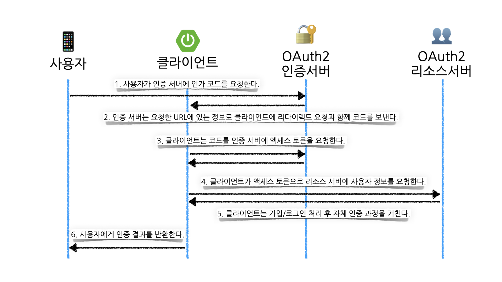
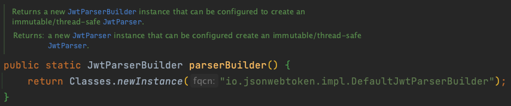

## 서론

안녕하세요.

페스타고의 글렌입니다. 🥃

페스타고는 인증을 구현할 때, 최소한의 정보로 안전하게 인증을 구현할 수 있는 OAuth2를 채택하였습니다.

OAuth2를 구현할 때 서비스를 제공하는 회사들은 매우 많습니다.

그중에서 저희가 선택한 OAuth2 제공자는 `카카오톡` 입니다.

카카오톡을 선택한 이유는 저희 서비스의 특성상 사용자 간의 티켓 거래를 막기 위함인데요.

구글이나 페이스북 등 쉽게 계정을 생성할 수 있는 서비스는 한 명의 사용자가 여러 계정을 통해 티켓을 예매할 수 있으므로, 국내에서 유일한 전화번호로 계정을 생성할 수 있는 서비스 제공자인 카카오톡을 선택하게 되었습니다.

페스타고에서 구현한 OAuth2의 인증 플로우는 다음과 같습니다.



이 방식은 `Authorization Code Grant Type`라고 불리는 OAuth2 인증 방식의 종류 중 하나입니다.

해당 인증 방식은 사용자는 신뢰할 수 있는 OAuth2 인증 서버로 요청을 보내고, 인증 서버는 클라이언트(백엔드 스프링 서버)에 엑세스 토큰과 사용자 정보를 반환합니다.

이러한 방식으로 사용자의 엑세스 토큰과 사용자 정보의 노출을 최소화할 수 있으므로 보안의 신뢰성이 높습니다.

이러한 방식을 어떻게 코드로 구현하였는지 설명하겠습니다.

코드로 구현할 클래스를 간략히 나타낸다면 한다면 다음과 같습니다.

`SocialType`: Enum으로 OAuth2의 제공자를 나타냅니다. (ex: KAKAO)

`AuthProvider`: 사용자 정보를 바탕으로 저희의 엑세스 토큰을 만들어 주는 역할을 합니다.

`AuthExtractor`: 엑세스 토큰을 파싱하여 유효성을 검증하고 Payload의 값을 추출하는 역할을 합니다.

`OAuth2Client`: OAuth2 인증, 리소스 서버로 요청을 보내고 엑세스 토큰, 사용자 정보 등 민감한 정보를 받는 역할을 합니다.

`Member`: 사용자의 정보를 담고 있는 엔티티로, `SocialType`을 필드로 가지고 있습니다.

`AuthService`: 인증을 수행하는 서비스 레이어 클래스입니다.

여기서 `OAuth2Client`는 외부 API에 의존하므로, 인터페이스로 만들어 테스트나 로컬 환경에서 모의 객체를 만들 수 있도록 하였습니다.
#### AuthProvider
```java
public class JwtAuthProvider implements AuthProvider {  
  
    private static final int SECOND_FACTOR = 60;  
    private static final int MILLISECOND_FACTOR = 1000;  
    private static final String MEMBER_ID_KEY = "memberId";
  
    private final SecretKey key;  
    private final long expirationMinutes;  
  
    public JwtAuthProvider(String secretKey, long expirationMinutes) {  
        this.key = Keys.hmacShaKeyFor(secretKey.getBytes(StandardCharsets.UTF_8));  
        this.expirationMinutes = expirationMinutes;  
    }  
  
    @Override  
    public String provide(AuthPayload authPayload) {  
        Date now = new Date();  
        return Jwts.builder()  
            .claim(MEMBER_ID_KEY, authPayload.getMemberId())   
            .setIssuedAt(now)  
            .setExpiration(new Date(now.getTime() + expirationMinutes * SECOND_FACTOR * MILLISECOND_FACTOR))  
            .signWith(key, SignatureAlgorithm.HS256)  
            .compact();  
    }  
}
```

AuthProvider의 구현체인 `JwtAuthProvider` 입니다.

`Member` 엔티티의 PK를 Payload에 넣어 JWT 토큰을 반환해 줍니다.

해당 토큰은 앞으로 저희 서버에 인증 과정에 필요한 엑세스 토큰입니다.

#### AuthExtractor
```java
public class JwtAuthExtractor implements AuthExtractor {  
  
    private static final String MEMBER_ID_KEY = "memberId";  
  
    private final JwtParser jwtParser;  
  
    public JwtAuthExtractor(String secretKey) {  
        SecretKey key = Keys.hmacShaKeyFor(secretKey.getBytes(StandardCharsets.UTF_8));  
        this.jwtParser = Jwts.parserBuilder()  
            .setSigningKey(key)  
            .build();  
    }  
  
    @Override  
    public AuthPayload extract(String token) {  
        Claims claims = getClaims(token);  
        Long memberId = claims.get(MEMBER_ID_KEY, Long.class);  
        return new AuthPayload(memberId);  
    }  
  
    private Claims getClaims(String code) {  
        try {  
            return jwtParser.parseClaimsJws(code)  
                .getBody();  
        } catch (ExpiredJwtException e) {  
            throw new UnauthorizedException(ErrorCode.EXPIRED_AUTH_TOKEN);  
        } catch (JwtException | IllegalArgumentException e) {  
            throw new UnauthorizedException(ErrorCode.INVALID_AUTH_TOKEN);  
        }  
    }  
}
```

AuthExtractor의 구현체인 `JwtAuthExtractor` 입니다.

토큰을 받아 `AuthPayload` 객체로 만들어 반환합니다.

참고로 필드로 `JwtParser`를 가지고 있는데 이는 `Jwts.parserBuilder()` 메소드로 생성된 인스턴스는 불변하고, thread-safe 하기 때문입니다.



따라서 다음과 같이 파싱할 때마다 인스턴스를 새롭게 만들지 않고, 기존의 인스턴스를 재사용할 수 있습니다.

```java
// 파싱마다 새로운 인스턴스 생성
return Jwts.parserBuilder()  
            .setSigningKey(key)  
            .build()
            .parseClaimsJws(code)  
            .getBody();

// 파싱마다 기존의 인스턴스 재사용
return jwtParser.parseClaimsJws(code)  
                .getBody();  
```

#### OAuth2Client
```java
@Component
public class KakaoOAuth2Client implements OAuth2Client {  
  
    private static final String ACCESS_TOKEN_URL = "https://kauth.kakao.com/oauth/token";  
    private static final String USER_INFO_URL = "https://kapi.kakao.com/v2/user/me";  
  
    private final RestTemplate restTemplate;  
    private final String grantType;  
    private final String clientId;  
    private final String redirectId;  
  
    public KakaoOAuth2Client(  
        @Value("${festago.oauth2.kakao.grant-type}") String grantType,  
        @Value("${festago.oauth2.kakao.client-id}") String clientId,  
        @Value("${festago.oauth2.kakao.redirect-uri}") String redirectUri,  
        RestTemplateBuilder restTemplateBuilder  
    ) {  
        this.grantType = grantType;  
        this.clientId = clientId;  
        this.redirectId = redirectUri;  
        this.restTemplate = restTemplateBuilder.build();  
    }  
  
    public String getAccessToken(String code) {  
        HttpHeaders headers = new HttpHeaders();  
        headers.setContentType(MediaType.APPLICATION_FORM_URLENCODED);  
        headers.add("grant_type", grantType);  
        headers.add("client_id", clientId);  
        headers.add("redirect_uri", redirectId);  
        headers.add("code", code);  
  
        try {  
            KakaoAccessTokenResponse response = restTemplate.postForEntity(  
                ACCESS_TOKEN_URL, headers,  
                KakaoAccessTokenResponse.class).getBody();  
            return response.accessToken();  
        } catch (HttpClientErrorException e) {  
            KakaoOAuth2Error kakaoOAuth2Error = e.getResponseBodyAs(KakaoOAuth2Error.class);  
            if (kakaoOAuth2Error.isErrorCodeKOE320()) {  
                throw new BadRequestException(ErrorCode.OAUTH2_INVALID_CODE);  
            }  
            throw new InternalServerException(ErrorCode.INTERNAL_SERVER_ERROR, e);  
        }  
    }  
  
    public UserInfo getUserInfo(String accessToken) {  
        HttpHeaders headers = new HttpHeaders();  
        headers.setContentType(MediaType.APPLICATION_FORM_URLENCODED);  
        headers.setBearerAuth(accessToken);  
  
        try {  
            KakaoUserInfo kakaoUserInfo = restTemplate.postForEntity(USER_INFO_URL, new HttpEntity<>(headers),  
                    KakaoUserInfo.class)  
                .getBody();  
            return UserInfo.ofKakao(kakaoUserInfo);  
        } catch (HttpClientErrorException e) {  
            throw new InternalServerException(ErrorCode.INTERNAL_SERVER_ERROR, e);  
        }  
    }  
  
    public record KakaoOAuth2Error(  
        String error,  
        @JsonProperty("error_description") String errorDescription,  
        @JsonProperty("error_code") String errorCode  
    ) {  
  
        public boolean isErrorCodeKOE320() {  
            return errorCode.equals("KOE320");  
        }  
    }  
}
```

실제 카카오 OAuth2 서비스 제공자에게 정보를 요청하는 `KakaoOAuth2Client` 입니다.

코드에 지저분한 곳이 많고, 단일 책임 원칙을 지키지 않는 부분이 있습니다. (액세스 토큰 요청, 사용자 정보 요청)

추후 이 부분을 어떻게 개선했는지 알려드리겠습니다.

> record에 @JsonProperty를 사용한 이유는 [스택 오버플로우 링크](https://stackoverflow.com/questions/68394911/why-record-class-cant-be-properly-deserialized-with-jackson)에 나와 있습니다.

#### AuthService
```java
@Service
@Transactional
public class AuthService {  
  
    private final MemberRepository memberRepository;  
    private final OAuth2Client oAuth2Client;  
    private final AuthProvider authProvider;  
  
    public AuthService(MemberRepository memberRepository, OAuth2Client oAuth2Client, AuthProvider authProvider) {  
        this.memberRepository = memberRepository;  
        this.oAuth2Client = oAuth2Client;  
        this.authProvider = authProvider;  
    }  
  
    public LoginResponse login(String code) {  
        String accessToken = oAuth2Client.getAccessToken(code);  
        UserInfo userInfo = oAuth2Client.getUserInfo(accessToken);  
        Member member = memberRepository.findBySocialIdAndSocialType(userInfo.socialId(), userInfo.socialType())  
            .orElseGet(() -> memberRepository.save(userInfo.toMember()));  
        return new LoginResponse(authProvider.provide(member), userInfo.nickname());  
    }  
}
```

컨트롤러에서 보내온 요청을 처리하는 서비스 클래스입니다.

흐름은 맨 위에서 설명한 것과 같이 코드를 받아, OAuth2 서비스 제공자로부터 액세스 토큰을 얻고, 사용자 정보를 얻은 뒤 기존의 회원이 있으면 `AuthProvider`를 통해 액세스 토큰을 반환하고, 기존의 회원이 없다면 `orElseGet()` 메서드를 통해 회원을 생성하고 액세스 토큰을 반환합니다.

---

이렇게 구현한 방식에는 문제점이 있습니다.

`OAuth2Client`의 코드를 보면 단일 책임 원칙을 지키지 못했고(액세스 코드와 사용자 정보를 모두 관리) 요청을 보낼 때 예외를 처리하기 위한 try-catch문 때문에 코드의 가독성이 나쁩니다.

그리고 `OAuth2Client`를 인터페이스로 정의하여 변경에는 유연하게 대응했지만, 단일 인스턴스이기 때문에 다른 OAuth2 서비스 제공자가 추가될 경우 새로운 클래스 혹은 메소드가 필요합니다.

### 단일 책임 원칙의 분리

유명한 객체 지향 원칙인 SOLID 원칙에서 S는 단일 책임 원칙을 뜻합니다.

스프링 프레임워크를 사용하며, 의존성 주입을 통한 OCP, DIP 원칙은 매우 쉽게 지킬 수 있으나, SRP 원칙은 구현하는 개발자가 객체가 가지는 책임을 얼마나 잘 구분할 수 있는지에 따라 달렸습니다.

OAuth2Client는 두 가지 일을 처리합니다.
1. 액세스 토큰을 요청
2. 사용자 정보를 요청

두 가지 일은 OAuth2 인증의 흐름으로는 하나의 작업으로 볼 수 있겠지만 객체가 가지는 책임은 두 가지 책임을 지고 있습니다.

따라서, 엑세스 토큰만 요청하는 클래스와 사용자 정보만 요청하는 클래스로 나눠 설계할 수 있습니다.

#### KakaoOAuth2AccessTokenClient
```java
@Component
public class KakaoOAuth2AccessTokenClient {  
  
    private static final String URL = "https://kauth.kakao.com/oauth/token";  
  
    private final RestTemplate restTemplate;  
    private final String grantType;  
    private final String clientId;  
    private final String redirectUri;  
  
    public KakaoOAuth2AccessTokenClient(  
        @Value("${festago.oauth2.kakao.grant-type}") String grantType,  
        @Value("${festago.oauth2.kakao.client-id}") String clientId,  
        @Value("${festago.oauth2.kakao.redirect-uri}") String redirectUri,
        @Value("${festago.oauth2.kakao.client-secret}") String clientSecret,  
        RestTemplateBuilder restTemplateBuilder  
    ) {  
        this.grantType = grantType;  
        this.clientId = clientId;  
        this.redirectUri = redirectUri;  
        this.clientSecret = clientSecret;
        this.restTemplate = restTemplateBuilder.build();  
    }  
  
    public String getAccessToken(String code) {  
        HttpHeaders headers = getAccessTokenHeaders(code);  
        return requestAccessToken(headers);  
    }  
  
    private HttpHeaders getAccessTokenHeaders(String code) {  
        HttpHeaders headers = new HttpHeaders();  
        headers.setContentType(MediaType.APPLICATION_FORM_URLENCODED);  
        headers.set("grant_type", grantType);  
        headers.set("client_id", clientId);  
        headers.set("redirect_uri", redirectUri);  
        headers.set("client_secret", clientSecret);
        headers.set("code", code);  
        return headers;  
    }  
  
    private String requestAccessToken(HttpHeaders headers) {  
        try {  
            KakaoAccessTokenResponse response = restTemplate.postForEntity(ACCESS_TOKEN_URL, headers,  
                KakaoAccessTokenResponse.class).getBody();  
            return response.accessToken();  
        } catch (HttpClientErrorException e) {  
            KakaoOAuth2Error kakaoOAuth2Error = e.getResponseBodyAs(KakaoOAuth2Error.class);  
            if (kakaoOAuth2Error.isErrorCodeKOE320()) {  
                throw new BadRequestException(ErrorCode.OAUTH2_INVALID_CODE);  
            }  
            throw new InternalServerException(ErrorCode.INTERNAL_SERVER_ERROR, e);  
        }  
    }
}
```

#### KakaoOAuth2UserInfoClient
```java
@Component
public class KakaoOAuth2UserInfoClient {  
  
    private static final String URL = "https://kapi.kakao.com/v2/user/me";  
  
    private final RestTemplate restTemplate;  
  
    public KakaoOAuth2UserInfoClient(RestTemplateBuilder restTemplateBuilder) {  
        this.restTemplate = restTemplateBuilder.build();  
    }  
  
    public UserInfo getUserInfo(String accessToken) {  
        HttpHeaders headers = getUserInfoHeaders(accessToken);  
        return requestUserInfo(headers);  
    }  
  
    private HttpHeaders getUserInfoHeaders(String accessToken) {  
        HttpHeaders headers = new HttpHeaders();  
        headers.setContentType(MediaType.APPLICATION_FORM_URLENCODED);  
        headers.setBearerAuth(accessToken);  
        return headers;  
    }  
  
    private UserInfo requestUserInfo(HttpHeaders headers) {  
        try {  
            KakaoUserInfo kakaoUserInfo = restTemplate.postForEntity(USER_INFO_URL, new HttpEntity<>(headers),  
                    KakaoUserInfo.class)  
                .getBody();  
            return kakaoUserInfo.toUserInfo();  
        } catch (HttpClientErrorException e) {  
            throw new InternalServerException(ErrorCode.INTERNAL_SERVER_ERROR, e);  
        }
    }
}
```

그리고 기존의 `KakaoOAuth2Client`는 다음과 같이 코드를 수정할 수 있습니다.

```java
@Component  
public class KakaoOAuth2Client implements OAuth2Client {

    private final KakaoOAuth2AccessTokenClient accessTokenClient;  
    private final KakaoOAuth2UserInfoClient userInfoClient;
    
    public KakaoOAuth2Client(KakaoOAuth2AccessTokenClient accessTokenClient, KakaoOAuth2UserInfoClient userInfoClient) {  
        this.accessTokenClient = accessTokenClient;  
        this.userInfoClient = userInfoClient;  
    }

    public String getAccessToken(String code) {  
        return accessTokenClient.getAccessToken(code)
    }  
  
    public UserInfo getUserInfo(String accessToken) {  
        return userInfoClient.getUserInfo(accessToken);
    }  
}
```

이제부터 `KakaoOAuth2Client` 클래스는 책임을 분리한 클래스에 요청을 위임하는 역할을 합니다.

#### ResponseErrorHandler

하지만 아직도 여전히 추한 try-catch가 코드에 남아있습니다.

`RestTemplate` 클래스에서 발생한 예외를 처리하기 위해 어쩔 수 없이 try-catch문을 사용해야 합니다.

그런데 여기서 잠깐,

저희는 스프링을 사용하며 컨트롤러, 서비스 레이어에 try-catch를 잘 사용하지 않습니다.

오히려 예외를 처리하지 않고 던져버립니다.

그러는 이유는 요청의 예외를 전역적으로 처리해 주는 `@ControllerAdvice`를 사용하기 때문입니다.

`RestTemplate` 클래스에서도 `@ControllerAdvice` 같은 역할을 할 수 있는 클래스가 있습니다.

바로 `ResponseErrorHandler` 입니다.

`ResponseErrorHandler`는 인터페이스로 다음과 같은 두 개의 추상 메소드를 가지고 있습니다.

```java
public interface ResponseErrorHandler {

    boolean hasError(ClientHttpResponse response) throws IOException;
    
    void handleError(ClientHttpResponse response) throws IOException;
}
```

사실 이미 `RestTemplate`에서는 기본적인 `ResponseErrorHandler`가 등록되어 있습니다.

```java
public class RestTemplate extends InterceptingHttpAccessor implements RestOperations {
    ...
    private ResponseErrorHandler errorHandler = new DefaultResponseErrorHandler();
    ...
}
```

따라서 기존의 `ResponseErrorHandler`를 사용하지 않고 커스텀한 에러 핸들러를 만들어 사용하면 예외 처리에 관한 로직을 분리할 수 있습니다.
#### KakaoOAuth2AccessTokenErrorHandler
```java
public class KakaoOAuth2AccessTokenErrorHandler extends DefaultResponseErrorHandler {  
  
    @Override  
    public void handleError(ClientHttpResponse response) throws IOException {  
        try {  
            super.handleError(response);  
        } catch (HttpStatusCodeException e) {  
            HttpStatusCode statusCode = response.getStatusCode();  
            handle4xxError(statusCode, e);  
            handle5xxError(statusCode);  
        }  
        throw new InternalServerException(ErrorCode.INTERNAL_SERVER_ERROR);  
    }  
  
    private void handle4xxError(HttpStatusCode statusCode, HttpStatusCodeException e) {  
        if (statusCode.is4xxClientError()) {  
            KakaoOAuth2ErrorResponse errorResponse = e.getResponseBodyAs(KakaoOAuth2ErrorResponse.class);  
            handleErrorCode(errorResponse);  
        }  
    }  
  
    private void handleErrorCode(KakaoOAuth2ErrorResponse errorResponse) {  
        handleKOE320Error(errorResponse);  
        throw new InternalServerException(ErrorCode.OAUTH2_INVALID_REQUEST);  
    }  
  
    private void handleKOE320Error(KakaoOAuth2ErrorResponse errorResponse) {  
        if (errorResponse != null && errorResponse.isErrorCodeKOE320()) {  
            throw new BadRequestException(ErrorCode.OAUTH2_INVALID_CODE);  
        }  
    }  
  
    private void handle5xxError(HttpStatusCode statusCode) {  
        if (statusCode.is5xxServerError()) {  
            throw new InternalServerException(ErrorCode.OAUTH2_PROVIDER_NOT_RESPONSE);  
        }  
    }  
  
    public record KakaoOAuth2ErrorResponse(  
        String error,  
        @JsonProperty("error_description") String errorDescription,  
        @JsonProperty("error_code") String errorCode  
    ) {  
  
        public boolean isErrorCodeKOE320() {  
            return Objects.equals(errorCode, "KOE320");  
        }  
    }  
}
```

#### KakaoOAuth2UserInfoErrorHandler
```java
public class KakaoOAuth2UserInfoErrorHandler extends DefaultResponseErrorHandler {  
  
    @Override  
    public void handleError(ClientHttpResponse response) throws IOException {  
        HttpStatusCode statusCode = response.getStatusCode();  
        handle4xxError(statusCode);  
        handle5xxError(statusCode);  
        throw new InternalServerException(ErrorCode.INTERNAL_SERVER_ERROR);  
    }  
  
    private void handle4xxError(HttpStatusCode statusCode) {  
        if (statusCode.is4xxClientError()) {  
            throw new InternalServerException(ErrorCode.OAUTH2_INVALID_REQUEST);  
        }  
    }  
  
    private void handle5xxError(HttpStatusCode statusCode) {  
        if (statusCode.is5xxServerError()) {  
            throw new InternalServerException(ErrorCode.OAUTH2_PROVIDER_NOT_RESPONSE);  
        }  
    }  
}
```

해당 에러 핸들러를 적용한 OAuth2Client는 다음과 같이 코드가 변경됩니다.
#### KakaoOAuth2AccessTokenClient
```java
@Component
public class KakaoOAuth2AccessTokenClient {  
  
    private static final String URL = "https://kauth.kakao.com/oauth/token";  
  
    private final RestTemplate restTemplate;  
    private final String grantType;  
    private final String clientId;  
    private final String redirectUri;  
  
    public KakaoOAuth2AccessTokenClient(  
        @Value("${festago.oauth2.kakao.grant-type}") String grantType,  
        @Value("${festago.oauth2.kakao.client-id}") String clientId,  
        @Value("${festago.oauth2.kakao.redirect-uri}") String redirectUri,
        @Value("${festago.oauth2.kakao.client-secret}") String clientSecret,  
        RestTemplateBuilder restTemplateBuilder  
    ) {  
        this.grantType = grantType;  
        this.clientId = clientId;  
        this.redirectUri = redirectUri;  
        this.clientSecret = clientSecret;
        this.restTemplate = restTemplateBuilder
            .errorHandler(new KakaoOAuth2AccessTokenErrorHandler())
            .build();  
    }  
  
    public String getAccessToken(String code) {  
        HttpHeaders headers = getAccessTokenHeaders(code);  
        return requestAccessToken(headers);  
    }  
  
    private HttpHeaders getAccessTokenHeaders(String code) {  
        HttpHeaders headers = new HttpHeaders();  
        headers.setContentType(MediaType.APPLICATION_FORM_URLENCODED);  
        headers.set("grant_type", grantType);  
        headers.set("client_id", clientId);  
        headers.set("redirect_uri", redirectUri);  
        headers.set("client_secret", clientSecret);
        headers.set("code", code);  
        return headers;  
    }  
  
    private String requestAccessToken(HttpHeaders headers) {  
        KakaoAccessTokenResponse response = restTemplate.postForEntity(ACCESS_TOKEN_URL, headers,  
            KakaoAccessTokenResponse.class).getBody();  
        return response.accessToken();  
    }
}
```

#### KakaoOAuth2UserInfoClient
```java
@Component
public class KakaoOAuth2UserInfoClient {  
  
    private static final String URL = "https://kapi.kakao.com/v2/user/me";  
  
    private final RestTemplate restTemplate;  
  
    public KakaoOAuth2UserInfoClient(RestTemplateBuilder restTemplateBuilder) {  
        this.restTemplate = restTemplateBuilder
            .errorHandler(new KakaoOAuth2UserInfoErrorHandler())
            .build();  
    }  
  
    public UserInfo getUserInfo(String accessToken) {  
        HttpHeaders headers = getUserInfoHeaders(accessToken);  
        return requestUserInfo(headers);  
    }  
  
    private HttpHeaders getUserInfoHeaders(String accessToken) {  
        HttpHeaders headers = new HttpHeaders();  
        headers.setContentType(MediaType.APPLICATION_FORM_URLENCODED);  
        headers.setBearerAuth(accessToken);  
        return headers;  
    }  
  
    private UserInfo requestUserInfo(HttpHeaders headers) {  
        KakaoUserInfo kakaoUserInfo = restTemplate.postForEntity(USER_INFO_URL, new HttpEntity<>(headers),  
                KakaoUserInfo.class)  
            .getBody();  
        return kakaoUserInfo.toUserInfo();  
    }
}
```

이처럼 예외를 처리하는 책임을 가진 객체로 분리하여, 요청을 보내는 객체에는 예외를 처리하는 코드 하나 없이 오로지 비즈니스 로직만 남게 된 것을 볼 수 있습니다.

### 새로운 OAuth2 클라이언트의 추가

서비스에서 사용하는 `OAuth2Client`는 인터페이스입니다.

인터페이스로 설계하여, OAuth2 서비스 제공자가 바뀌더라도 쉽게 교체할 수 있고, 모의 OAuth2Client 객체를 만들어서 테스트할 때 외부 API의 연동 없이 테스트할 수 있습니다.

하지만 이렇게 인터페이스를 사용하도록 만들어도, 인스턴스의 필드가 하나이기 때문에 추가적인 OAuth2Client를 사용하려면 서비스 제공자마다 서비스 클래스를 만들거나, 필드와 메소드가 생길 것입니다.

```java
public class KakaoOAuth2Service{
    ...
};

public class NaverOAuth2Service{
    ...
};

// 또는

public class AuthService {

    private final OAuth2Client kakaoOAuth2Client;
    private final OAuth2Client naverOAuth2Client;
    
    public void loginKakaoOAuth2(String code) {
        ...
    }
    public void loginKakaoOAuth2(String code) {
        ...
    }
}
```

이것은 단일 책임 원칙을 지켰다고 할 수 있겠지만, 중복된 코드가 생기게 되고 새로운 서비스 제공자가 생길 때 새로운 메소드를 추가해 줘야 합니다.

그렇다면 어떻게 하나의 필드로 여러 `OAuth2Client`를 사용할 수 있을까요?

스프링은 의존성을 주입할 때 컬렉션으로 의존성을 주입해 주는 기능을 제공합니다.

따라서 다음과 같이 여러 `OAuth2Client`를 `List` 형식으로 받을 수 있습니다.

```java
public class AuthService {

    private final List<OAuth2Client> oAuth2Clients;

    public AuthService(List<OAuth2Client> oAuth2Clients) {
        this.oAuth2Clients = oAuth2Clients;
    }
}
```

이것이 바로 인터페이스를 의존하게 하면 얻을 수 있는 강력한 이점 중 하나입니다.

그런데, 단순히 List 타입으로 받았다고 해서 끝나는 것은 아닙니다.

리스트 중에서 사용자가 원하는 서비스 제공자를 선택할 수 있어야 합니다.

```java
public OAuth2Client getClient(SocialType socialType) {
    return oAuth2Clients.stream()
        .filter(client -> client.getSocialType == socialType)
        .findAny()
        .orElseThrow(() -> BadRequestException(...));
}
```

이렇게 Stream을 활용해서 사용자가 원하는 서비스 제공자를 선택할 수 있겠지만, 매번 Stream을 사용하여 원하는 서비스 제공자를 찾는 작업은 비효율적입니다.

이때는 List 자료구조를 사용하는 것 보다 Map 자료구조를 사용하면 효율적일 것입니다.

스프링은 Map 타입으로도 의존성 주입을 제공합니다.

하지만 Map으로 의존성을 주입받으면 Key가 String인 `kakaoOAuth2Client`와 같이 지정됩니다.

```java
private final Map<String, OAuth2Client> oAuth2ClientMap;
```

따라서 다음과 같이 의존성 주입은 List로 받은 뒤, 내부에서 Map으로 변환시키면 Key가 Enum 타입인 Map을 사용할 수 있습니다.

```java
private final Map<SocialType, OAuth2Client> oAuth2ClientMap = new EnumMap<>(SocialType.class);

public AuthService(List<OAuth2Client> oAuth2Clients) {
    for (OAuth2Client oAuth2Client: oAuth2Clients) {
        oAuth2ClientMap.put(oAuth2Client.getSocialType(), oAuth2Client);
    }
}
```

이제 다음과 같이 특정 클라이언트를 빠르게 찾아올 수 있습니다.

```java
public OAuth2Clients getOAuth2Client(SocialType socialType) {
    return Optional.ofNullable(oAuth2ClientMap.get(socialType))  
        .orElseThrow(() -> new BadRequestException(...));
}
```

하지만 이것 또한 완벽하게 해결한 것은 아닙니다.

필드에 `OAuth2Client`에 대한 자료구조가 그대로 노출이 되고 있습니다.

`AuthService` 클래스에서 필요한 기능은 SocialType에 맞는 OAuth2Client만 선택하는 것입니다.

`AuthService` 클래스는 Map에 대한 기능을 자세히 알 필요는 없습니다.

이것은 저희가 레벨1부터 배워온 방법을 사용하면 쉽게 해결할 수 있습니다.

바로 `일급 컬렉션`으로 만드는 것입니다.

```java
@Component
public class OAuth2Clients {
    private final Map<SocialType, OAuth2Client> oAuth2ClientMap = new EnumMap<>(SocialType.class);

    public OAuth2Clients(List<OAuth2Client> oAuth2Clients) {
        for (OAuth2Client oAuth2Client: oAuth2Clients) {
            oAuth2ClientMap.put(oAuth2Client.getSocialType(), oAuth2Client);
        }
    }

    public OAuth2Client getClient(SocialType socialType) {
        return Optional.ofNullable(oAuth2ClientMap.get(socialType))  
            .orElseThrow(() -> new BadRequestException(...));
    }
}
```

그리고 `AuthService`의 코드는 다음과 같이 변합니다.

```java
@Service
@Transactional
public class AuthService {
    private final OAuth2Clients oAuth2Clients;

    ...

    public LoginResponse login(SocialType socialType, String code) {  
        OAuth2Client oAuth2Client = oAuth2Clients.getClient(socialType);
        String accessToken = oAuth2Client.getAccessToken(code);  
        UserInfo userInfo = oAuth2Client.getUserInfo(accessToken);  
        Member member = memberRepository.findBySocialIdAndSocialType(userInfo.socialId(), socialType)  
            .orElseGet(() -> memberRepository.save(userInfo.toMember()));  
        return new LoginResponse(authProvider.provide(member), userInfo.nickname());  
    }  
} 
```

이제 새로운 OAuth2Client가 추가되어도 기존의 코드를 변경할 필요는 전혀 없어집니다.

또한 로컬 환경 또는 테스트 환경을 위한 모의 OAuth2Client를 만들더라도 `@Profile`  어노테이션의 사용으로 운영 환경에서는 전혀 영향을 주지 않게 할 수 있습니다.

```java
@Component  
@Profile("!prod")  
public class FestagoOAuth2Client implements OAuth2Client {  
  
    private static final String PROFILE_IMAGE = "https://placehold.co/150x150";  
  
    private final Map<String, UserInfo> userInfoMap = new HashMap<>();  
  
    public FestagoOAuth2Client() {  
        userInfoMap.put("1", new UserInfo("1", getSocialType(), "member1", PROFILE_IMAGE));  
        userInfoMap.put("2", new UserInfo("2", getSocialType(), "member2", PROFILE_IMAGE));  
        userInfoMap.put("3", new UserInfo("3", getSocialType(), "member3", PROFILE_IMAGE));  
    }  
  
    @Override  
    public UserInfo getUserInfo(String accessToken) {  
        return Optional.ofNullable(userInfoMap.get(accessToken))
            .orElseThrow(() -> new BadRequestException(...));
    }  
  
    @Override  
    public SocialType getSocialType() {  
        return SocialType.FESTAGO;  
    }  
}
```

## 결론

OAuth2를 사용한 인증 기능을 구현할 때, 스프링이 제공하는 의존성 주입 기능과 인터페이스를 사용한 다형성 활용 등, 객체 지향 설계를 따라 코드를 구현하면 변경에 유연하고 가독성이 높은 코드를 만들 수 있습니다.

저희 서비스 특성상 새로운 OAuth2 서비스 제공자가 추가될 확률은 낮겠지만, 레벨 1, 2 과정을 배우며 습득한 객체 지향 설계 원칙을 이렇게 서비스에 녹여냈다는 점이 뿌듯한 것 같습니다.

